# BNS parameter estimation at Cosmic Explorer, in about three minutes

Driver: [`bin/run_bns_ce_pe.py`](../bin/run_bns_ce_pe.py)

End-to-end parameter estimation on a binary-neutron-star injection as a
next-generation detector would see it: m1 = m2 = 1.4 M☉, zero spins, f_lower = 10 Hz,
4096 Hz sampling, zero-noise data in a single detector with the Cosmic Explorer
P1600143 PSD. Network SNR 607, with a ~1000 s inspiral in band. Four parameters are
sampled — chirp mass, η, and both aligned spins — with uniform priors and extrinsics
fixed. The likelihood is frequency-domain relative binning; the sampler is jaxpe's HMC
with a dense mass matrix, interleaved with normalizing-flow global proposals.

**Result: 3.11 min mean wall clock on one Quadro T2000 Max-Q**, converged to
rank-normalized split-R̂ < 1.01, verified across three random seeds:

| seed | production blocks | R̂ | min ESS | wall clock |
|---|---|---|---|---|
| 42 | 25 | 1.0092 | 9 463 | 3.49 min |
| 7 | 22 | 1.0097 | 14 795 | 2.95 min |
| 13 | 21 | 1.0095 | 18 919 | 2.89 min |

That is down from **15.42 min** when this benchmark first met its original 20-minute
target — a 5× improvement. Reproduce with:

```bash
python bin/run_bns_ce_pe.py          # run twice: the second is compile-free
```

All timings assume a warm persistent XLA cache (`~/.cache/jaxpe_xla`), which the first
invocation populates. Compilation is excluded deliberately; it is a one-off, and
including it measures the compiler rather than the sampler.


Where the 209 s of the seed-42 run goes: setup 40 s (PSD, injection, relative-binning
summary data, MAP + Laplace, validation), warmup 14 s, flow fit 7 s, equilibration
34 s, production 113 s.

---

## The bug that mattered more than every tuning decision combined

Most of the speedup came from one line in `jaxpe/kernels/base.py`. `run_chains`
initialised its chains like this:

```python
states = jax.vmap(lambda x: kernel.init(x, logp_fn))(x0)   # outside the jit!
```

That `vmap` is not jitted, so every operation in the target's gradient graph was
dispatched to the GPU individually. For a gravitational-wave likelihood that graph is
about 3600 instructions, and the cost is brutal:

| chain initialisation, 64 chains | |
|---|---|
| eager `vmap` (as it was) | **2.215 s** |
| the same work jitted | **0.004 s** |

Roughly 550× — and it was a *fixed* cost, paid on every `run_chains` call regardless of
how many steps that call took. The benchmark makes about 33 such calls per run
(5 warmup + 3 step-size re-tune + 25 production), so something like 74 s of a 290 s run
was this. Initialisation now happens inside `_run_chains_jit`, which already took
`logp_fn` as a static argument, so there is no new jit cache and no extra
recompilation. Every sampler in jaxpe benefits, not just this benchmark.

Two regression tests guard it (`tests/test_kernels.py`): one asserts the target is
never invoked with concrete (untraced) values during `run_chains`, which is the
structural cause rather than a flaky wall-clock threshold; the other asserts that 4× the
steps costs meaningfully more than 1× — a fixed-cost-dominated implementation lands near
parity.

### It had also been quietly corrupting the measurements

This is the uncomfortable part, and the most useful thing on this page. A 2.25 s fixed
cost per call sits inside anything measured on top of it, and it made three conclusions
look solid that were not:

| conclusion, measured under the bug | after the fix |
|---|---|
| halving local steps per block loses (5.27 vs 4.83 min) | **wins**: 3.11 vs 3.74 min mean over three seeds |
| 3 vs 5 equilibration rounds is "within noise" (8 s apart) | 3 rounds wins by 35 s; now the default |
| the per-block cost budget "closes", so no overhead remains | 2.25 s/block of eager dispatch was hiding inside what that sum called gradient work |

The middle one is instructive: halving the local steps could only ever recover 0.65 s of
a 6.6 s block while a fixed 2.25 s was charged per call, so that experiment was rigged
against itself before it started.

What found the bug was switching from *point* measurements to a *scaling* fit. A sum
that balances at one configuration tells you nothing about what happens when the
configuration changes; fitting `T = fixed + marginal × work` across several sizes
exposed a 2.254 s intercept immediately. That profiler is now a committed tool,
[`bin/profile_sampler_scaling.py`](../bin/profile_sampler_scaling.py) — worth running
first on any new hardware, since the interesting question there is *which* costs move.

---

## How the sampler is put together

1. **Setup, CPU-pinned.** CE PSD via `lalsimulation`'s series API; injection over a
   2048 s segment (wrap-free for a ~1000 s inspiral, df = 1/2048 Hz); relative-binning
   summary data compressing 3.75M band points to **125 bins**. The dense grids never
   reach the GPU — on a 4 GB card shared with a desktop they do not fit.
2. **A lean hot log-posterior.** A closure over only the O(n_bins) summary arrays plus
   fixed-extrinsic projection constants, so IMRPhenomD is evaluated at 126 bin edges
   instead of millions of frequencies. Asserted equal to the class implementation at
   machine precision, and validated against the dense likelihood with the β error model
   (bulk |Δ lnL| < 0.1, measured 2.5e-2). Exact-at-fiducial to 1e-8 relative.
3. **MAP + Laplace metric.** Damped Newton with eigenvalue clipping and backtracking —
   monotone, so it cannot leave the fiducial point's basin. Its Hessian becomes the
   dense HMC mass matrix, with soft eigenvalues floored for the boundary directions.
4. **Warmup.** Robbins–Monro step-size adaptation at the production trajectory length,
   averaging log ε over the post-transient blocks. Chains stranded on secondary ripples
   of the oscillatory matched-filter likelihood (Δ lnL ~ −10³) are re-seeded.
5. **Equilibration**, all discarded: flow rounds that spread the chains and bootstrap
   the flow, then a short step-size re-tune against the *equilibrated* positions.
6. **Production.** Local HMC (L = 32) interleaved with 1200 flow independence proposals
   per block, the flow refit every fourth block behind a revert guard.
7. **Convergence gate**, checked per block: rank-normalized split-R̂ over the global
   subseries < 1.01, Geyer min ESS ≥ 2000, and no stuck chains.

### Why this posterior is awkward

The PN phase ties chirp mass, η and the spins into a thin, curved valley — Mc and η are
~97 % anti-correlated. The equal-mass injection puts η exactly on its 0.25 prior edge
and both spins on their 0.0 edge, so in unconstrained (sigmoid) coordinates the soft
directions become Exponential-tailed rather than Gaussian. A single fixed metric cannot
precondition both the needle-thin chirp-mass direction (σ ~ 10⁻⁶ M☉) and those boundary
tails, which is the whole reason there is a flow in the loop.

---

## What actually made it fast

**Re-tune the step size after equilibration, not just during warmup.** Worth
10.56 → 6.2 min on its own. Warmup adapts ε while the chains are still inside a 0.3σ
ball, whose curvature is not the curvature they will later see — measured, that left
production running at 0.94–0.96 acceptance, meaning ε was far too small and almost all
the gradient work was buying no displacement. Three discarded local blocks after
equilibration, targeting the *same* acceptance but evaluated where the chains actually
are, fixes it. This is also what makes short trajectories (L = 32) viable, halving
per-block cost at essentially unchanged block count.

**Halve the flow.** 8 → 4 coupling layers, worth 6.59 → 5.31 min mean. The global block
runs *two* flow passes per proposal (`sample` and `log_prob`), which dominates it:
3.38 s per 1200-step block at 8 layers, of which only 0.61 s is the likelihood. Eight
layers is generous for a four-dimensional posterior, and this is the rare change that is
a pure win rather than a trade — block count unchanged, acceptance *improved*
(0.40 → 0.59), faster at both seeds tested, no variance inflation. Four layers is the
knee: at two layers the capacity genuinely degrades and the block count jumps 24 → 33.

**Persistent XLA compilation cache.** Setup 3.5 min → 49 s, back in the first round.

**O(n) diagnostics.** R̂ and ESS were recomputed over the whole growing sample stack
every block, which is O(n²) across a run. Each block is now decimated on arrival and
mapped to physical space once, and the global block is fetched from the device once
instead of three times. Worth ~8 s — real, but a quarter of what the visible-looking
redundancy suggested.

**Fewer chains than you would guess.** Per-step cost is strongly sublinear in chains
(32 → 1024 chains is 32× the work for 5× the time), so at 64 chains the GPU is
latency-bound, not throughput-bound. 64 chains give ~2.4× more per-chain steps per
second than 256, and R̂ depends on per-chain length.

---

## What did not work

Kept because they carve the design space — and because several were only *later* shown
to have failed for measurement reasons rather than physical ones.

| tried | outcome |
|---|---|
| **float32** | 3× faster and wrong. A BNS inspiral from 10 Hz accumulates ~10⁵ radians of phase; f32's ~7 significant digits leave ~0.01 rad, and the exact-at-fiducial check returned lnL = −34 instead of 0. The coalescence-time phase *can* be cancelled analytically (t_c is fixed, so it divides out of the heterodyne ratio) but the intrinsic phase cannot. |
| **Widening the flow's spline interval** | A variance trap. Outside its `interval` the RQ-spline is the identity, so wider proposals do reach the Exponential boundary tails — best case 3.87 min. But acceptance collapses (0.55 → 0.36 → 0.09), and at ~0.1 acceptance convergence becomes a lottery: the same configuration took 10.71 min at another seed. Mean over two seeds is *worse* than the default, with a 2.75× spread against 1.15×. |
| **Cycling narrow + wide flow kernels** | Exact (each sub-block is posterior-invariant, so their composition is too) and useless: the wide component accepts at 0.02, contributing nothing while consuming half the proposals and an extra flow fit. |
| **Ensemble covariance as the mass matrix** | Local acceptance goes to exactly 0.00. The equilibration ensemble is ~40× over-dispersed in the chirp-mass direction, which is five orders of magnitude tighter than the others, so every trajectory leaves the ridge. One such run hit 4.74 min and was rejected as a flow-only sampler. |
| **Longer trajectories at fixed ε** | Acceptance collapses to 0.03–0.19: ε does not transfer across trajectory lengths, because leapfrog energy error accumulates along the trajectory. |
| **More chains (256)** | Four times the flow training data really does cut block count 25 → 17, but per-block cost rises in step and the whole loss is *preamble*: warmup and equilibration run a fixed number of steps, so their cost scales with chains while their benefit does not. |
| **More flow proposals (2400)** | Fewer blocks, costlier blocks, net loss. |
| **Trimming warmup to 2 blocks** | Saves 11 s, costs 140 s. Warmup's real job is not ε adaptation — the post-equilibration re-tune does that — it is supplying the flow's *first* training set. With 2 blocks the fit degrades from loss 0.206 to 0.681. |
| **Trimming the MAP search** | 24 → 12 Newton steps saved 5 s of setup and cost ~350 s of sampling via a worse metric. |
| **Adam to find the MAP** | Leaves the basin entirely (lnL −1.2e5): normalized steps are far larger than the σ ~ 10⁻⁶ chirp-mass needle. |
| **Freezing the flow once acceptance looks healthy** | A mediocre frozen flow never improves; R̂ stalled at 1.05 for 21 blocks. Keep refitting, but retain the previous flow and revert if acceptance collapses. |

### A soundness rule, learned the hard way

**A configuration only counts if the local HMC kernel has non-zero acceptance in
production.** Two separate configurations reached attractive wall-clock numbers by
silently killing the gradient kernel and converging as pure flow-driven independence
samplers. They pass R̂ and ESS. They are not what this benchmark measures, and their
timings are not comparable.

### And a rule about measurement

Several negatives above were re-tested after conditions changed, and **seven of them
reversed.** The recurring error was treating a measurement as a property of the
*problem* when it was a property of the *configuration it was taken in*. Concretely:
"short trajectories starve the flow" was true at a fixed step size and false once ε was
re-tuned; "halving local steps loses" was true under a fixed per-call cost and false
without it. Re-measuring stale negatives was by far the highest-yield habit in this
whole exercise — including the one that produced the final result.

Related: a single-seed timing is not a measurement when acceptance is low. The 3.87 min
figure above was committed as a result and retracted a few minutes later when the same
configuration took 10.71 min at another seed. Differences below ~15 % between two
single-seed runs on this problem are not resolved by the data.

---

## Correctness

The fast configuration is compared to the 15.4-minute reference sample-set to
sample-set with [`bin/compare_bns_posteriors.py`](../bin/compare_bns_posteriors.py):

| comparison | worst JS | worst median shift |
|---|---|---|
| reference vs shipped configuration | 5.2e-3 | 0.046 σ |
| **control: two independent runs of the same configuration** | **4.6e-3** | 0.047 σ |

The control is the point: re-running the sampler moves the posterior about as much as
any of these changes do. The 5.2e-3 sits marginally *above* that floor rather than
comfortably below it — the same order as sampler noise, and well under the 1e-2
acceptance threshold. (The 1e-3 figure quoted in the relative-binning status page
belongs to a deterministic grid comparison with no Monte Carlo noise and does not
transfer to sample-based comparisons at these sizes.)


Median chirp mass 1.2187730 M☉ against an injected 1.2187707 — a measurement to roughly
one part in 10⁶, which is what SNR 607 over a ~1000 s inspiral buys. Chirp mass is drawn
as an offset from the injection because its posterior is only ~10⁻⁶ M☉ wide. The three
right/bottom-most panels — m1, m2, χ_eff — are not themselves sampled; they are computed
per-sample from (chirp_mass, η, spin1z, spin2z), the same map used everywhere else on
this page, so they can be read off directly instead of reconstructed by hand from the
sampled corner.

**The marginals are one-sided about the truth by construction, not biased.** Truth
recovery comes out at +1.84 σ in chirp mass, −1.86 σ in η and ~+1 σ in both spins, and
those same offsets appear in the 15.4-minute reference. The injection sits exactly on
the η = 0.25 prior boundary; Mc and η are ~97 % anti-correlated, so truncating η from
above truncates Mc from below (and, equivalently, pushes m1 up and m2 down — visible
directly in their panels now). The spin panels show the expected χ_eff degeneracy
triangle — only the mass-weighted combination is measured, so the individual spins slide
along the anti-diagonal until the positive-support priors cut them off, which pushes
their medians above zero and η's below its truth; the χ_eff panel makes that combination
explicit — it is the actual spin quantity this measurement constrains, not the
individual spins.

### Nothing is tuned to this source

A standing constraint on this work: no per-binary tuning, and **no changes to the physics
of the templates** — no dropping waveform content, no reduced-frequency-content
approximations, no reduced precision in template evaluation. Every timing on this page
evaluates the full three-region IMRPhenomD in float64. All the speedups are
sampler-side; in particular the flow supplies Metropolis–Hastings proposals, so the
target density is preserved exactly however good or bad the flow happens to be.

Component masses are `--mass1/--mass2`, η's truth follows from them, priors and the
optimiser start are derived at runtime, and every adaptation is driven by measured
acceptance. Verified by rerunning a **1.35 + 1.25 M☉** injection with no retuning: it
converges (R̂ 1.0097, chirp mass recovered exactly, same boundary signature), picks its
own step sizes, and passes relative-binning parity on its own waveform.

The *configuration* carries over; the *wall clock* does not. That source needs 41 blocks
and ~5.0 min rather than 25 and 3.5 min — it is simply a harder posterior, and it needed
proportionally more blocks under every earlier configuration too. Its η truth sits just
*inside* the prior edge (0.24963) rather than exactly on it, trading a pinned corner for
a genuinely curved two-dimensional ridge.

One related defect, found and fixed: `--max-production-blocks` defaulted to 40, which
the unequal-mass run hit at R̂ = 1.0107 and therefore reported as *not converged*. It
needed 42. A cap that turns "needs slightly longer" into "failed" is measuring the cap;
`--max-minutes` is the real budget guard, and the default is now 80.

### Beyond BNS: a mass sweep to 80 M☉

The 1.35 + 1.25 M☉ check above verifies the configuration survives a *slightly*
unequal BNS. [`bin/run_mass_sweep_pe.py`](../bin/run_mass_sweep_pe.py) pushes the same
question much further: six equal-mass injections, log-spaced in total mass from 2.8 M☉
(BNS) to 80 M☉ (BBH), each run unmodified through this page's exact HMC + flow pipeline
via `run_bns_ce_pe.py` — same code, same defaults, only `--mass1/--mass2`, segment
duration, and distance change per injection. Duration is sized per injection from
LALSimulation's own chirp/merger/ringdown time bounds rather than reusing 2048 s
everywhere (a 40+40 M☉ signal is in band for ~5 s from 10 Hz); distance is solved to a
comparable-but-not-identical network SNR (~18–23) via the exact 1/D scaling now exposed
as `--target-snr` on `run_bns_ce_pe.py` itself.

| M_tot (M☉) | SNR | duration | time to converge | R̂_max | min ESS |
|---:|---:|---:|---:|---:|---:|
| 2.80 (BNS) | 21.6 | 2048 s | 3.39 min | 1.0098 | 9,492 |
| 5.47 | 19.6 | 512 s | 3.33 min | 1.0097 | 12,617 |
| 10.70 | 22.2 | 256 s | 2.60 min | 1.0092 | 12,185 |
| 20.93 | 21.2 | 64 s | 2.10 min | 1.0099 | 9,741 |
| 40.92 | 17.6 | 32 s | 1.88 min | 1.0074 | 10,833 |
| 80.00 (BBH) | 22.9 | 8 s | 1.80 min | 1.0096 | 14,623 |


All six converge on the same R̂/ESS gate as everywhere else on this page, and completion
time falls **monotonically** with mass, 3.39 → 1.80 min, rather than growing or
non-monotonically wandering. That is the expected direction — higher mass means a
shorter segment and fewer relative-binning bins, so it is cheaper per gradient, not just
per second of data — but it was an assumption in the "What is left" section below until
this sweep measured it. It is not proof the sampler's *hyperparameters* (flow spline
interval, equilibration rounds, ...) are optimal all the way to 80 M☉, only that the
BNS-tuned defaults, left untouched, still reach the same convergence gate there.

Raw sweep output: [`mass_sweep_summary.csv`](assets/mass_sweep_summary.csv); figure via
`python bin/plot_mass_sweep_timing.py <sweep_summary.csv>`.

#### Posteriors across the sweep

Same layout as the BNS corner plot above — chirp mass, η, spin1z, spin2z, plus the
derived m1, m2, χ_eff (χ_eff = (m1·spin1z + m2·spin2z)/(m1+m2)) panels appended, truth
marked throughout — one per injection, in increasing total mass. The table below is the
same derived quantities made quantitative (median and 90% CI), for reference without
opening every image:

| M_tot (M☉) | m1 truth / median [90% CI] | m2 truth / median [90% CI] | χ_eff truth / median [90% CI] |
|---:|---|---|---|
| 2.80 | 1.400 / 1.650 [1.526, 1.760] | 1.400 / 1.194 [1.125, 1.286] | 0 / 0.017 [0.005, 0.032] |
| 5.47 | 2.737 / 3.278 [3.016, 3.500] | 2.737 / 2.300 [2.166, 2.489] | 0 / 0.023 [0.007, 0.040] |
| 10.70 | 5.352 / 6.393 [5.886, 6.779] | 5.352 / 4.508 [4.272, 4.875] | 0 / 0.024 [0.007, 0.041] |
| 20.93 | 10.464 / 12.444 [11.427, 13.189] | 10.464 / 8.853 [8.391, 9.598] | 0 / 0.025 [0.008, 0.042] |
| 40.92 | 20.458 / 24.188 [22.281, 25.726] | 20.458 / 17.411 [16.436, 18.835] | 0 / 0.025 [0.009, 0.042] |
| 80.00 | 40.000 / 46.705 [42.930, 49.955] | 40.000 / 34.484 [32.293, 37.452] | 0 / 0.025 [0.009, 0.041] |

m1/m2 are one-sided about the truth for the same reason chirp-mass/η are (see above): η
is truncated at its true value of exactly 0.25, so the posterior only ever sees
`eta <= eta_true`, which pushes `m1` up and `m2` down at every mass — this is a prior
boundary artifact, not a mass asymmetry the sampler invented. χ_eff is similarly
one-sided **because the spin priors are** (`Uniform(0, 0.05)` on each of spin1z/spin2z,
not centered on 0), so a mass-weighted average of two positive-truncated quantities
comes out positive even when both truths are exactly 0. Both effects are visible
directly in the corner plots below and are already discussed for the BNS case earlier
on this page; the table above is the same statement made quantitative at every mass in
the sweep.

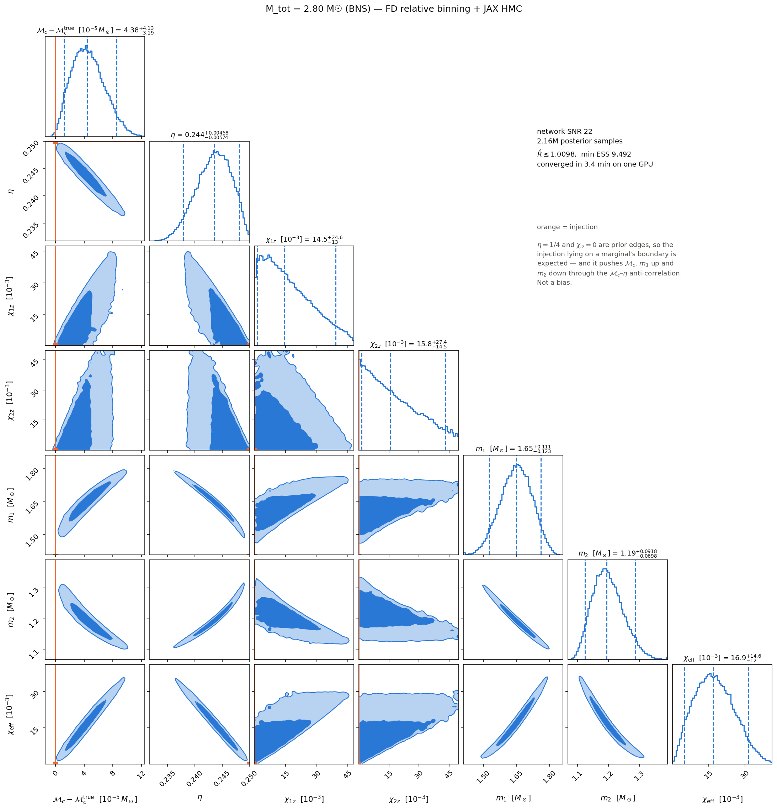

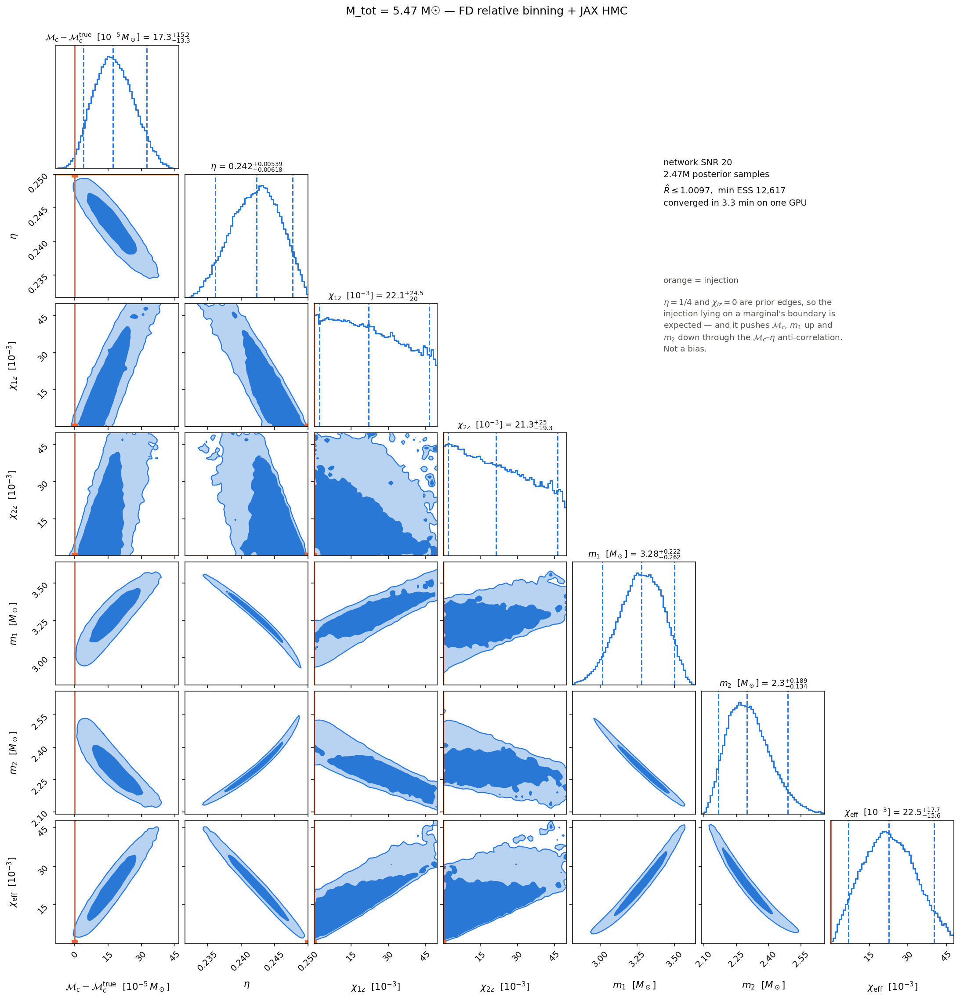

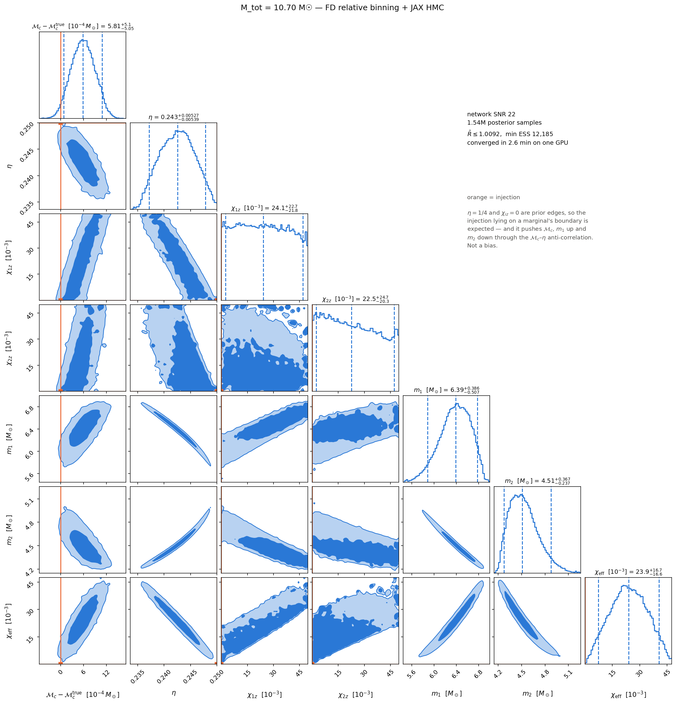

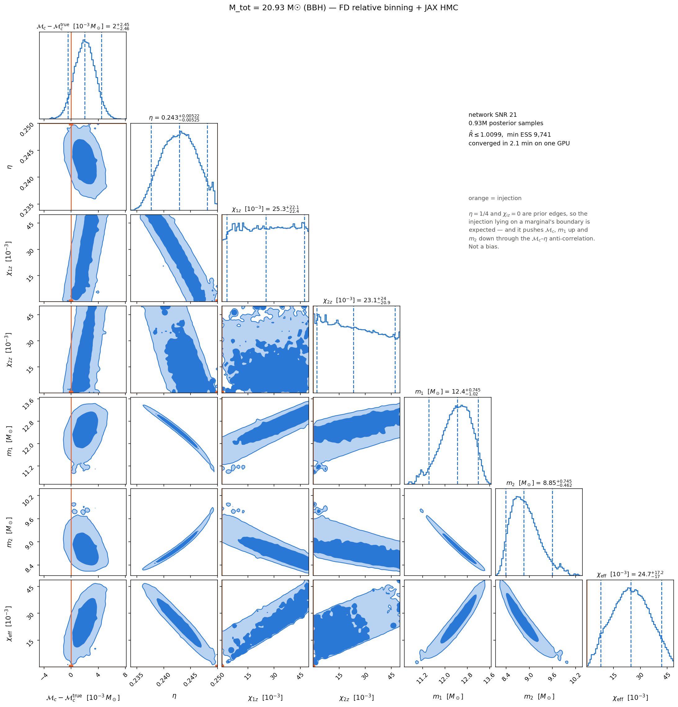

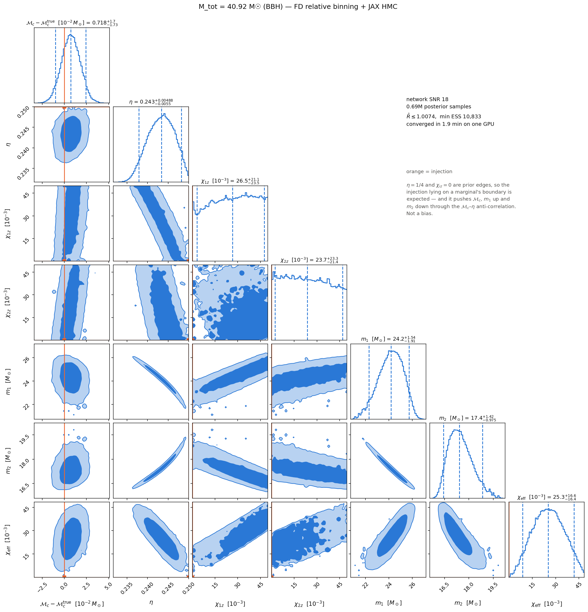

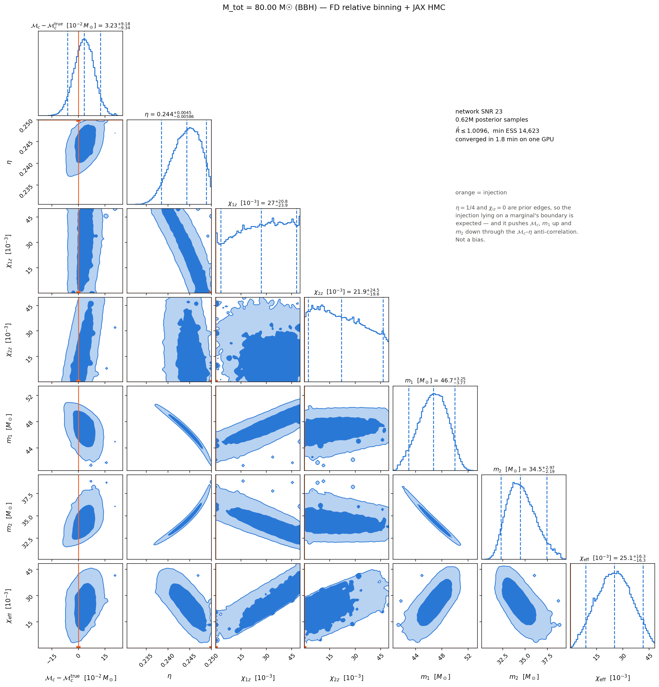

A trend is visible across the set that has nothing to do with sampler performance and
everything to do with the physics: **the spin1z/spin2z marginals flatten as mass
increases.** At 2.8 M☉ they peak sharply at zero and fall off by z ~ 0.03; by 10.7 M☉
they are already close to flat; by 80 M☉ they are indistinguishable from the uniform
[0, 0.05] prior. A higher-mass signal spends fewer inspiral cycles in band before
merger, and it is the accumulated spin-orbit phasing over many cycles that measures
spin — fewer cycles means less of that signature, independent of how well the sampler
mixes. The chirp-mass/η anti-correlation (the same one described for the BNS case
above) persists at every mass, since it comes from the η = 0.25 prior boundary, not from
the source.

> **These six runs predate the MAP start-point fix described in the next section.** They
> used a fixed 2 % inset off the prior edge; the optimiser start is now chosen from a
> ladder. At these masses with a narrow zero-centred spin prior the difference is
> immaterial — but the numbers above were measured before it, and have not been re-run.

---

## Spinning binaries, and all five transition kernels

Everything above holds spins near zero: the reference BNS injects χ₁ᶻ = χ₂ᶻ = 0 under a
one-sided `Uniform(0, 0.05)` prior. That turns out to be a load-bearing assumption in two
places that have nothing to do with the sampler, and both surface immediately when the
suite is pushed to realistic aligned spins.

The suite: **ten equal-mass injections**, log-spaced from 2.8 to 80 M☉, each component
classified NS below 3 M☉ and BH at or above, aligned-spin truth drawn per component from
±0.05 (NS) or ±0.9 (BH), recovery prior widened to the symmetric range of the wider
component, distance solved per injection to a comparable-but-not-identical network SNR
(~18–23). Each is then sampled by **all five `jaxpe.kernels` transition kernels** on the
same 90-minute budget and the same R̂ < 1.01 / ESS ≥ 2000 gate used everywhere else here.
Seven of the ten are reported: the other three refine to 6 375–7 900 relative-binning bins
and are measured below as infeasible on this hardware.

### Two defects a ±0.9 spin prior exposed

**1. The MAP optimiser started in the wrong place, and failed silently.** The Laplace
mass matrix comes from a damped-Newton MAP started at the fiducial point, inset off any
prior edge it lies on (the sigmoid bijection sends open bounds to ±∞, so a start exactly
on a boundary is not representable). That inset was a fixed 2 % of the prior width.
Because the injection is zero-noise, lnL peaks at *exactly* 0 at the fiducial, so the
inset's cost is directly measurable — and at 55 M☉, insetting η by 0.02 × 0.05 = 10⁻³
costs **392 nats**. Newton then starts 392 below the peak, climbs monotonically exactly
as designed, and still terminates at a prior *corner* (η = 0.2, χ₁ᶻ = χ₂ᶻ = −0.9) whose
Laplace covariance has σ ~ 10⁻¹³. Nothing raises; the run proceeds to sample with a mass
matrix that is numerically a delta function.

The optimiser is now run from **every** rung of a ladder (2×10⁻² … 2×10⁻⁶) and the best
*converged* mode is kept, rejecting any whose Laplace covariance has collapsed. Selecting
on the rung's *starting* log-posterior — the obvious cheaper version — is wrong, and
measurably so: for the zero-spin BNS that criterion picks the 2×10⁻⁴ rung, which climbs
to a mode pinned against the η boundary at log-posterior −26.8 with a smallest σ_y of
6.8×10⁻⁷, where the 2×10⁻² rung reaches −17.6 at 4.3×10⁻⁶, a metric 6× wider in its
tightest direction. Newton only accepts improvements, so every rung is a valid local
ascent; which *basin* it lands in is what the start decides, and only the final mode
reveals that.

Re-running the reference BNS confirms the validated path is unchanged: the ladder keeps
2×10⁻² (log-posterior −17.6, against −20.0 / −26.8 / −33.5 / −40.4 for the finer rungs),
converges at R̂ = 1.0098 with min ESS 21 846, and recovers chirp mass 1.21877 against an
injected 1.21877.

> **Caveat on the suite below.** The best-converged-mode criterion was found *while*
> performing that reference check, after the ten-injection suite had already been run
> against a shared setup cache built with the cheaper start-log-posterior criterion.
> Rebuilding the cache both ways and comparing: the two criteria select different rungs on
> most injections, but converge to **essentially the same mode anyway** — the resulting
> Laplace covariances agree to within 3 % on eight of ten. The exceptions are 26.2 M☉
> (1.77× wider in its tightest direction under the corrected criterion) and 38.0 M☉ (57×,
> one of the three that never produced a result). So the caveat is narrow but not empty,
> and it is *not* neutral for the cross-kernel comparison: a metric that is too tight
> penalises single-step kernels far more than HMC.
>
> **The suite below has since been re-run in full against the corrected cache**, so the
> results reported here are no longer subject to this caveat. It is kept because the
> difference mattered: measured against the corrected metric, the cross-kernel divergences
> that the first pass reported (12–32× the Monte-Carlo floor) fall to 3.6–5.1×. A metric
> defect that agrees to 3 % on eight of ten injections still moved the headline conclusion
> of a kernel comparison by roughly a factor of four.

**2. Relative-binning resolution is set by the prior volume, not the source.** The
heterodyne's linear-in-f ratio model must hold across the parameters actually *proposed*,
so widening the spin prior from ±0.05 to ±0.9 at SNR ≈ 20 breaks it: measured RB-vs-dense
tail ratios of 0.22–0.50 against a 5×10⁻³ tolerance, 40–100× outside contract. `--epsilon`
now auto-refines (quartering, tolerances never relaxed) until the existing parity guard
passes. The cost is real and is recorded per injection: half the grid needs 490–7 900
bins where the BNS reference needs 125.

Neither is visible at BNS masses with narrow spin priors, which is why both survived.

### Making it a fair comparison

The solved distance, refined `--epsilon`, and MAP+Laplace mode and covariance depend only
on the injection, never on the kernel. They are derived **once per injection** and shared
across all five sweeps via `--setup-cache`, so every kernel samples a bit-identical
likelihood from a bit-identical mass matrix and any difference is a difference between
kernels alone. Two further corrections were needed before the comparison meant anything:

- **`--max-production-blocks` was binding instead of the time budget.** At its previous
  default of 80, MALA hit the cap on 6 of 10 injections having spent only 6.4 of its 12
  allowed minutes. A fixed block cap penalises exactly the kernels that take smaller steps
  per block, so the comparison would have measured the cap. Default raised to 400.
- **The 12-minute budget itself was binding**, and it was the single largest source of
  "did not converge" in the first pass of this suite: 13 of 35 runs ended on
  `production wall-clock budget exhausted` with R̂ still falling monotonically block over
  block and no stuck chains. Those were unfinished runs, not failures. Raised to
  **90 minutes**, which converts every one of them except MMALA's two. A budget-limited
  run is reported as not converged either way — the point is that reading it as a
  statement about the *kernel* was wrong.
- **ULD's step size was never a measured choice.** It has no acceptance signal to adapt
  on, so `--step-size` is held fixed for the whole run, and the first pass left it at the
  default of 0.5 while the MH kernels' own adaptation selected **0.006–0.033** on these
  same posteriors. Running an unadjusted integrator at 15–80× the step the geometry
  supports does not measure the cost of dropping the accept/reject step; it measures a
  broken step size. It now takes MALA's adapted value per injection via
  `--step-size-from`, and the difference is not subtle — see the ULD discussion below.
- **Everything runs on CPU, not the GPU** — because mid-suite the CUDA driver wedged
  (`cuInit` → `CUDA_ERROR_UNKNOWN`, while `nvidia-smi` continued to report a perfectly
  healthy card). This is a fallback, not a preference: measured per production block, the
  T2000 is **1.9–2.6× faster** than this CPU (see "Different hardware" below). What
  matters for the comparison is only that all five kernels ran on the *same* device;
  absolute wall clocks here are therefore ~2.3× the GPU figures quoted elsewhere on this
  page and should not be compared across sections.

  A caution worth recording, since it nearly went into this page as a result: an early
  CPU-vs-GPU comparison appeared to show the CPU *winning*, because the GPU side of it
  was measured while the driver was already degrading (per-block cost had silently
  tripled before it failed outright). The healthy-GPU numbers say the opposite.
  `run_mass_sweep_pe.py --require-gpu` now creates and exercises a real CUDA context
  before the first injection and aborts if it cannot; `nvidia-smi` is documented there as
  explicitly *not* a valid readiness check.

### Results

**30 of 35 runs pass the gate.** End-to-end minutes on identical CPU hardware, against
the corrected setup cache and the 90-minute budget:

| M_tot (M☉) | bins | HMC | MALA | MMALA | RandomWalk | ULD |
|---:|---:|:--|:--|:--|:--|:--|
| 2.8 | 125 | ✅ 21.8 | ✅ 19.1 | ✅ 19.7 | ✅ 12.5 | ✅ 20.9 |
| 4.1 | 499 | ✅ 69.0 | ✅ 69.0 | ✗ R̂ 1.0136 | ✅ 42.8 | ✅ 50.1 |
| 5.9 | 125 | ✅ 11.4 | ✅ 17.1 | ✅ 17.8 | ✅ 10.1 | ✅ 10.7 |
| 8.6 | 499 | ✅ 64.8 | ✅ 46.8 | ✗ R̂ 1.0320 | ✅ 60.7 | ✗ R̂ 1.0355 |
| 26.2 | 125 | ✅ 26.1 | ✗ R̂ 1.0129 | ✅ 35.4 | ✅ 48.6 | ✅ 61.9 |
| 55.1 | 490 | ✅ 46.5 | ✅ 62.4 | ✅ 35.5 | ✅ 35.7 | ✅ 35.6 |
| 80.0 | 124 | ✅ 13.1 | ✅ 31.0 | ✅ 42.1 | ✅ 31.4 | ✗ R̂ 1.0114 |

✅ = passed the gate, with end-to-end minutes; ✗ = budget exhausted, with the R̂ reached.
HMC and RandomWalk are 7/7, MALA 6/7, MMALA and ULD 5/7. The earlier reading of this
table — that bin count, not kernel, decides whether a run converges — **was an artefact
of too small a budget**: with 90 minutes the 490+ bin injections converge for almost
everything, and the two remaining MMALA failures are the longest runs in the suite
(96 and 95 minutes) rather than the most expensive posteriors.

**Passing the gate and getting the right answer are not the same thing, and this suite
separates them in both directions.** ULD at 55.1 M☉ *converged* — R̂ 1.0095, ESS 7531 —
and is 51× the Monte-Carlo floor away from HMC on η. MALA at 26.2 M☉ and ULD at 80.0 M☉
*failed* the gate and are statistically indistinguishable from HMC (0.9–2.6× and
0.5–2.0× the floor). R̂ measures whether chains agree with each other, which is not the
same as agreeing with the target; the next subsection measures the second thing.

**Three injections are absent from this table entirely** (12.4, 18.0 and 38.0 M☉, the
ones the parity guard pushed to 6 375–7 888 bins), and they are the clearest statement of
what the refinement costs. Re-run alone with a 25-minute budget, the 12.4 M☉ case spends
617 s in warmup, 950 s in equilibration, and then **325 s per production block**, reaching
only R̂ = 1.13 after four blocks. Extrapolating the block count these posteriors need,
each run is hours, and the fifteen runs (three injections × five kernels) are tens of
hours on this hardware. They were abandoned rather than reported as fast failures; no
sampler was given an advantage, because none of them got a result.

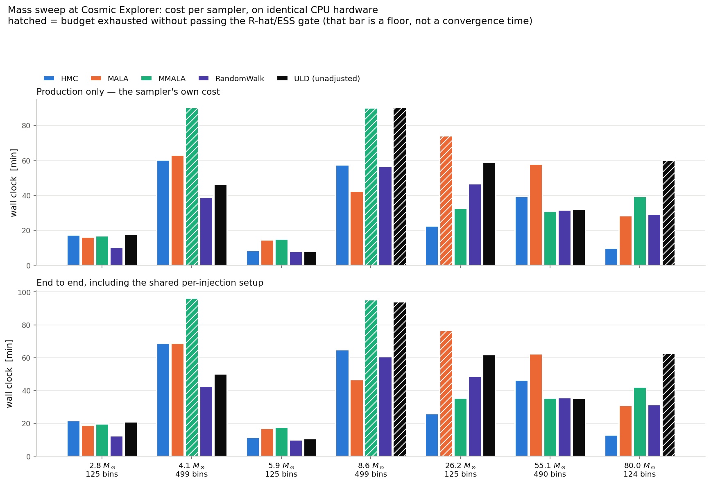

The figure is grouped by binary rather than plotted against mass on purpose: cost here
tracks bin count, and a line against a mass axis would draw a trend that does not exist.

### Medians agree; the distributions differ at the boundary

Posterior *medians* against HMC's, in units of HMC's own posterior σ, worst over all four
sampled parameters and all seven binaries:

| kernel | worst median shift vs HMC |
|---|---:|
| MALA | 0.48 σ (η, 8.6 M☉) |
| MMALA | 0.40 σ (η, 8.6 M☉) |
| RandomWalk | 0.17 σ (η, 8.6 M☉) |
| ULD | 0.50 σ (η, 55.1 M☉) |

All four land in the right place to within half a σ. A median is one number from a
four-dimensional distribution, and it is the number every kernel here gets right.

Jensen–Shannon divergence against HMC (same estimator as
[`compare_bns_posteriors.py`](../bin/compare_bns_posteriors.py)) is more discriminating.
Referred to a null built by splitting HMC's *own* chains in half — the honest Monte-Carlo
floor, since any two finite samples of the same distribution have JS > 0 — the median
over all 28 (binary, parameter) pairs is:

| kernel | median | worst |
|---|---:|---:|
| RandomWalk | 1.7× floor | 6.7× (η, 55.1 M☉) |
| ULD | 3.5× | 51× (η, 55.1 M☉) |
| MALA | 3.6× | 26× (η, 8.6 M☉) |
| MMALA | 5.1× | 37× (η, 55.1 M☉) |

**This is the number that most changed when the suite was re-run properly.** The first
pass of this comparison put MALA and MMALA at 12–32× the floor and concluded the
MH-corrected kernels were substantially under-dispersed relative to HMC. Against the
corrected mass matrix and an adequate budget the medians are 3.6× and 5.1×. Most of that
gap was **a suboptimal shared metric being amplified by single-step kernels, not a
property of the kernels** — which the earlier text could only spot-check on one binary
and now holds across all seven.

**What survives is narrower, one-sided, and concentrated at the prior boundary.** Every
non-HMC kernel returns a *narrower* 90 % credible interval than HMC on almost every
parameter of every binary: median width ratios 0.80 (MALA), 0.84 (MMALA and ULD), 0.92
(RandomWalk), and only 0–11 % of the 28 comparisons come out wider at all.

The sharpest discriminator is the η = 0.25 pileup — the feature this page's sampler was
built around ("the η → 1/4 and spin → 0 pileups that no fixed mass matrix equilibrates").
Fraction of the posterior within 10⁻³ of that edge:

| M_tot (M☉) | HMC | MALA | MMALA | RandomWalk | ULD |
|---:|---:|---:|---:|---:|---:|
| 2.8 | 15.9 % | 0.11 % | 5.3 % | 9.6 % | 1.5 % |
| 8.6 | 3.4 % | 0.00 % | 0.22 % | 1.2 % | 0.00 % |
| 26.2 | 9.0 % | 3.1 % | 3.7 % | 6.5 % | 5.9 % |
| 55.1 | 13.9 % | 1.8 % | 0.37 % | 5.5 % | **0.01 %** |
| 80.0 | 14.4 % | 7.6 % | 10.5 % | 10.6 % | 8.8 % |

HMC reaches the boundary more than every other kernel on every binary, and the ordering
(HMC, then RandomWalk, then MMALA/MALA/ULD) is the same ordering as the JS table. The
55.1 M☉ row is the extreme case and is visible directly in that binary's corner figure:
because η = 0.25 means m₁ = m₂, a kernel that misses the pileup pushes the derived m₁
marginal to higher masses, and ULD's modal m₁ sits at 35.0 M☉ against HMC's 29.2 (the
injected value being 27.6).

**Is HMC right, or merely different?** Two arguments that it is the least truncated, and
one reason to keep the question open. η_true = 0.25 exactly for these equal-mass
injections *and* is a hard prior edge, so genuine posterior mass there is expected, and
HMC's η median is the closest to truth on every binary checked. The unconstrained-space
bijection sends η = 0.25 to +∞, so reaching it requires long excursions, and HMC's 32
leapfrog steps travel ~32× further per proposal than any single-step kernel — the
mechanism predicts exactly the observed ordering. But this is an argument from mechanism
plus a self-consistency check, **not an independent verification of the boundary mass**;
nothing here measures it against a reference that is not itself one of these samplers.

**ULD needs its previous entry on this page retracted.** The first pass reported it as
catastrophically broken: up to 27 % non-finite draws, JS 0.15–1.00 against a ~0.005
floor, a chirp-mass median 218 σ from HMC's, and never passing the gate at any mass.
**Every one of those numbers was measuring a step size of 0.5 that nothing had chosen** —
15–80× what the MH kernels' adaptation selects on the same posteriors. Run at MALA's
adapted step per injection, ULD produces **zero** non-finite draws, a worst median shift
of 0.50 σ, a median JS of 3.5× the floor, and passes the gate on 5 of 7 binaries. It is
an ordinary member of this comparison, not an outlier.

The genuine cost of dropping the accept/reject step is narrower and better localised:
ULD has no Metropolis correction, so its stationary distribution carries an O(ε²)
discretisation bias **by construction** (`jaxpe/kernels/uld.py`) and does not converge to
the right answer at any run length at fixed ε. That bias is what the 55.1 M☉ result
shows — converged by R̂ (1.0095, ESS 7531), 51× the floor from HMC on η, and 0.01 %
boundary occupancy against HMC's 13.9 %, i.e. **1400× less**. Its chains agree with each
other and disagree with the target. This is the honest measurement of the unadjusted
tradeoff, and it is much smaller than the previous text claimed while being a sharper
statement of the same thing.

Two structural caveats that no amount of budget addresses: `mala`, `uld` and
`random-walk` use their `scale` **elementwise** in `jaxpe.kernels`, so they receive
per-dimension marginal standard deviations rather than the dense Cholesky factor `hmc`
and `mmala` get, and cannot see the ~97 % M_c–η anti-correlation at all; and `mmala` runs
in its documented constant-metric mode, which its own docstring calls equivalent to
dense-mass MALA, not the full Riemannian variant. Only `hmc` has tuned numbers behind it
here — the others use jaxpe's library-default acceptance targets, which are literature
values not measured on this posterior, and production acceptance drifts well off even
those. Retuning them is a confound this suite does not remove.

### Posteriors, all samplers overlaid

One figure per binary, every kernel on common axes, injection marked. The 1-D marginals
are **densities rather than counts** — the kernels return different numbers of samples,
and a count histogram would read a longer run as a taller posterior. Axis ranges are the
union of each kernel's 0.5–99.5 percentile box, so a kernel that sampled somewhere else
widens the frame rather than vanishing off the edge of its own comparison.

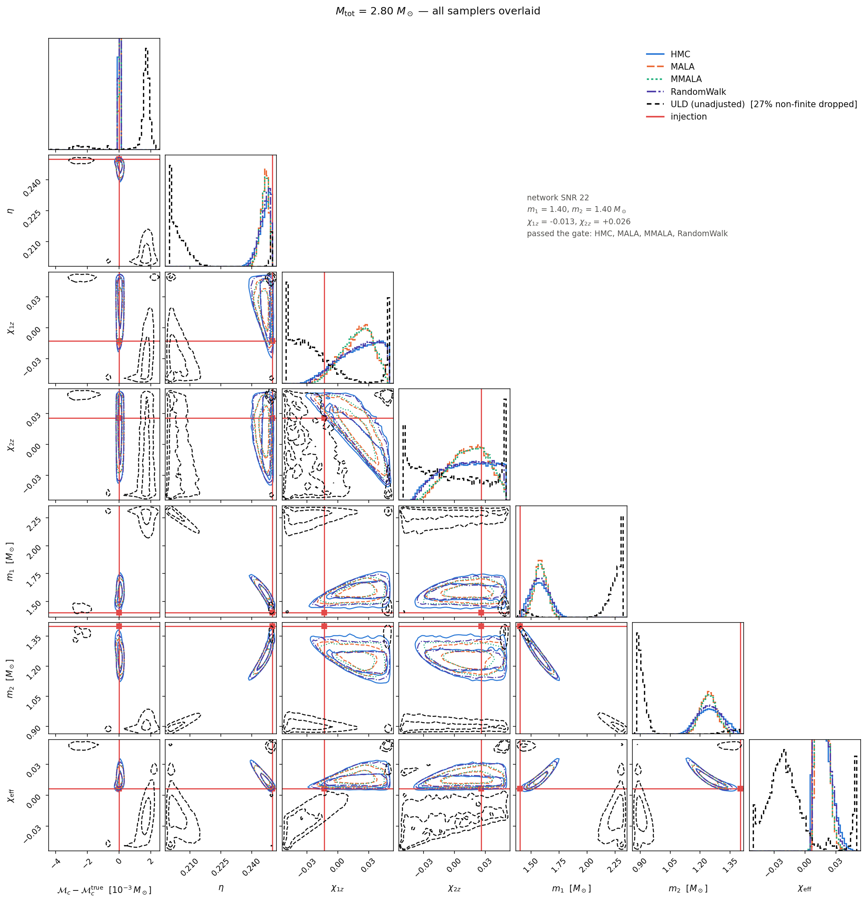

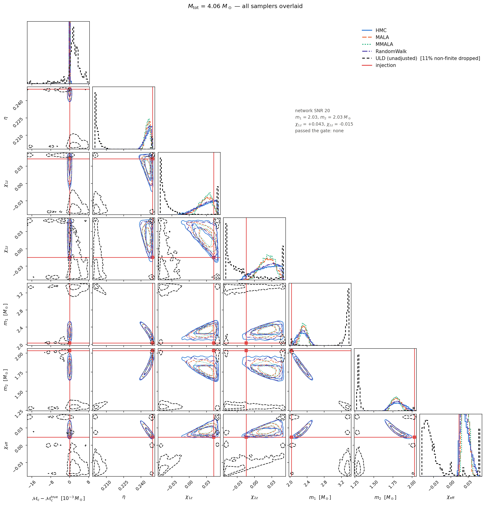

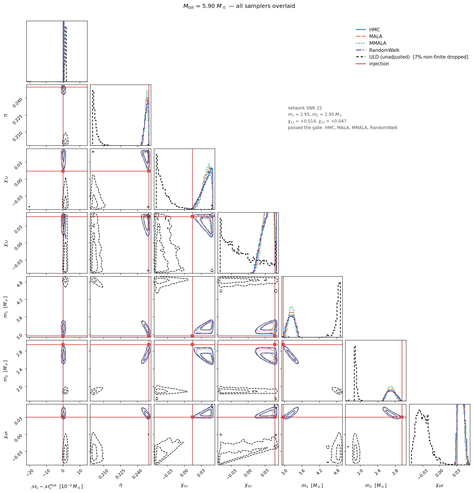

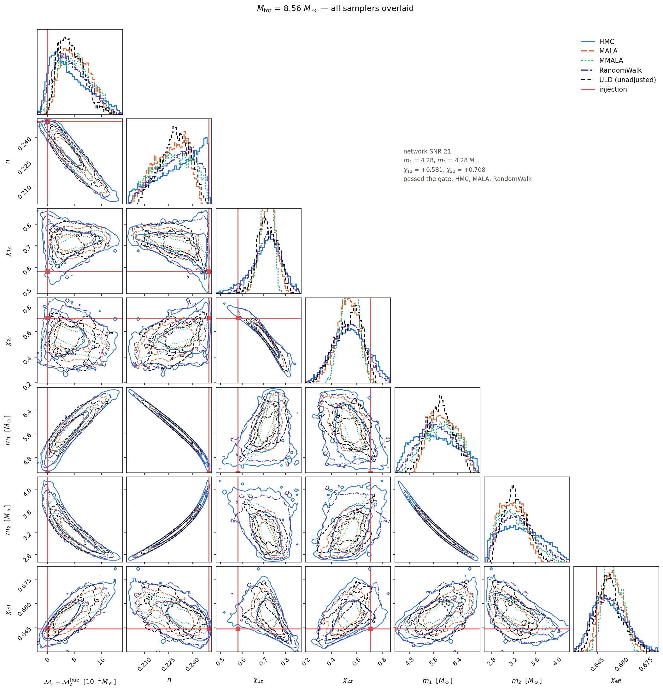

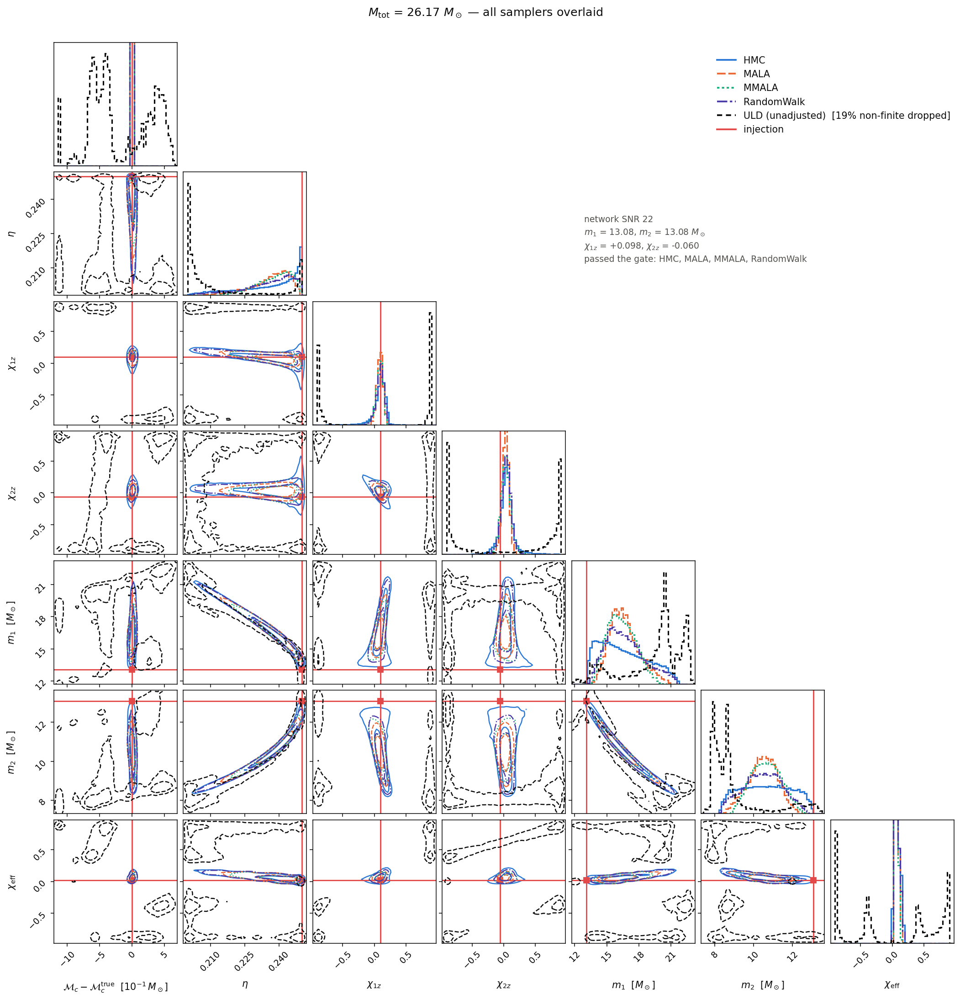

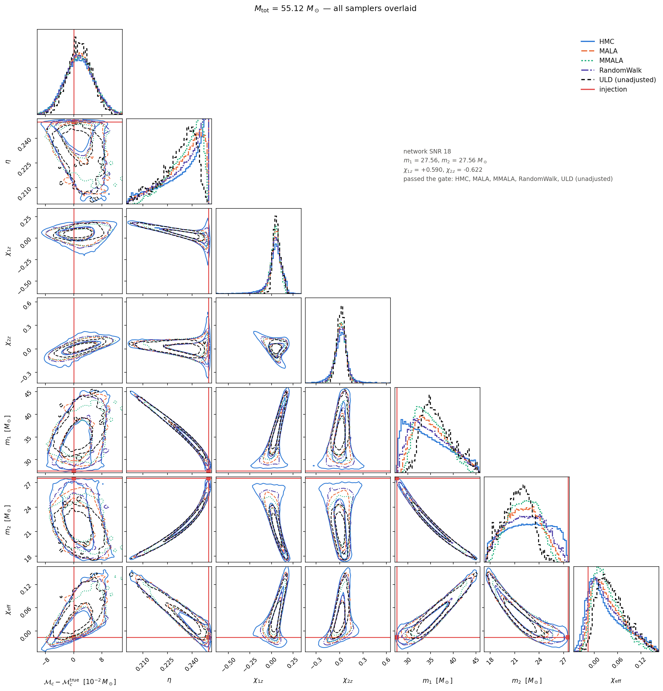

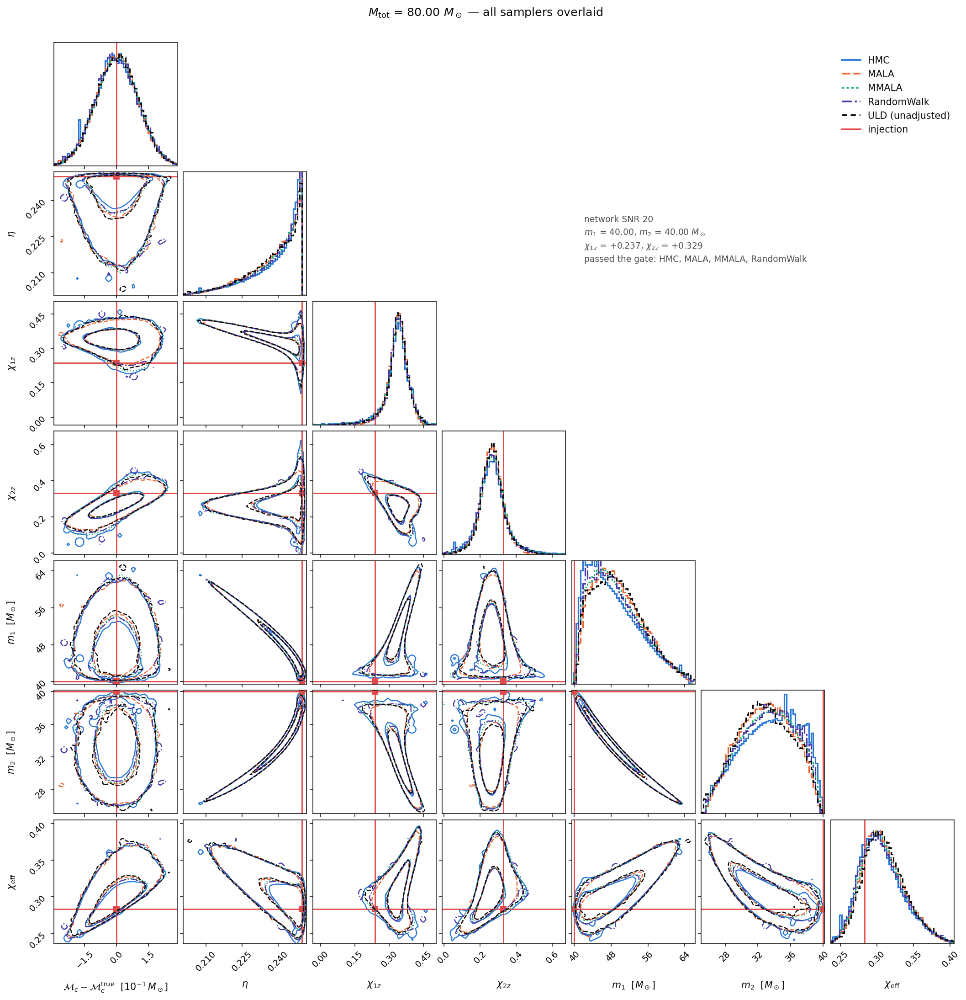

All five contour sets now sit on top of one another in most panels of most figures —
including ULD's, which in the first pass of this suite sat somewhere else entirely. Where
they separate, they separate at the η = 0.25 edge and in the m₁/m₂ marginals that edge
controls. The 55.1 M☉ figure is the one to read: every kernel passed the gate there (the
info box lists all five), yet ULD's m₁ marginal peaks at 35.0 M☉ where HMC's peaks at
29.2 against an injected 27.6 — entirely because ULD put 0.01 % of its samples against
the equal-mass boundary and HMC put 13.9 %. A figure in which every curve overlaps and
one derived marginal does not is the clearest picture on this page of what the
convergence gate does and does not certify.

The spin panels show the expected χ_eff physics at these SNRs: individual aligned spins
are barely measured, and at 55.1 M☉ the injected +0.590/−0.622 pair (χ_eff ≈ −0.016)
recovers as two broad marginals peaked near zero with the *combination* constrained —
which is why χ_eff is carried as its own panel rather than left to be reconstructed.

Raw per-kernel output: [`sampler_sweep_hmc.csv`](assets/sampler_sweep_hmc.csv) and the
four alongside it. Figures via
`python bin/make_sampler_comparison_figures.py --root <sweep root>`.

---

## What is left, if you want to go further

Production is still ~55 % of the run, and the dominant term is the IMRPhenomD gradient
itself: a long serial dependency chain (~3600 instructions, 5 fusions) whose cost is
sublinear in chains and nearly flat in bin count. Trajectory length is at its measured
knee, the flow is at its measured knee, and both halves of the preamble are load-bearing
in both directions.

- **Different hardware.** fp64 throughput is what matters here, and it is *not* a
  professional-versus-consumer distinction: the T2000 and the A40 both run fp64 at 1/32
  of fp32. A100/H100-class parts (1/2 rate) are the ones that change this arithmetic. A
  larger card also lifts the 4 GB constraint that forces setup onto the CPU, and makes
  large chain counts cheap enough to be worth revisiting.

  **The CPU is closer than the fp64 rates suggest, but does not win.** Measured per
  production block on four injections, the T2000 is **1.9–2.6× faster** than the 12-core
  Xeon W-10855M (4.1–5.3 s/block against 10.1–10.4 s/block). That is a far smaller margin
  than a GPU-versus-CPU comparison normally implies — the card's 1/32 fp64 rate puts it
  near 40 GFLOPS against ~149 GFLOPS fp64 measured on the CPU, and the GPU wins anyway on
  memory bandwidth and on vmapping 64 chains — but it does mean a CPU-only run of this
  pipeline is perfectly practical, at roughly 2.3× the wall clock.
- **A cheaper exact gradient**, e.g. a reduced-order or surrogate waveform. That is a
  different accuracy contract from trimming PhenomD and needs its own validation.
- **Skipping unused waveform regions** is *ruled out*, not deferred. `Phase`/`Amp`
  evaluate all three frequency regions and select with heaviside masks, and JAX
  evaluates both sides of a `where`. Timed end to end, eliminating the unused ones caps
  out at ~6 % of the run — the 4× HLO instruction-count ratio badly overstates it,
  because those instructions are cheap elementwise work over 126 points. Not worth
  editing a 4000-line waveform module for, and it falls under the template constraint
  regardless.

---

## Reproducing the figures

```bash
python bin/make_bns_ce_figures.py     # reads examples/output/bns_ce_rb_hmc/
python bin/make_sampler_comparison_figures.py --root <dir of per-kernel sweeps>
```

The five-kernel sweep behind that second figure, on a machine with two GPUs. The setup
cache must be built **once and serially** first — it is what makes every kernel sample a
bit-identical likelihood and mass matrix, and two concurrent sweeps pointed at an empty
cache dir race to write the same file:

```bash
ROOT=examples/output/sampler_sweep
COMMON="--n-injections 10 --max-minutes 90 --setup-cache $ROOT/cache --require-gpu"

CUDA_VISIBLE_DEVICES=0 python bin/run_mass_sweep_pe.py $COMMON \
    --outdir $ROOT/_setup --extra-args --setup-only

CUDA_VISIBLE_DEVICES=0 bash -c 'for k in hmc mmala; do
    python bin/run_mass_sweep_pe.py '"$COMMON"' --kernel $k --outdir '"$ROOT"'/$k; done' &
CUDA_VISIBLE_DEVICES=1 bash -c 'for k in mala random-walk; do
    python bin/run_mass_sweep_pe.py '"$COMMON"' --kernel $k --outdir '"$ROOT"'/$k; done' &
wait

# uld last: it has no acceptance signal to adapt on, so it takes MALA's adapted
# step size per injection rather than a default nothing chose
CUDA_VISIBLE_DEVICES=0 python bin/run_mass_sweep_pe.py $COMMON \
    --kernel uld --outdir $ROOT/uld --step-size-from $ROOT/mala
```

[`bin/make_bns_ce_figures.py`](../bin/make_bns_ce_figures.py) rebuilds all three figures
from run artefacts, so every number on the axes traces back to a measurement rather than
to this page. The convergence series and the per-configuration stage timings are cached
to [`bns_ce_convergence.csv`](assets/bns_ce_convergence.csv) and
[`bns_ce_speed_stages.csv`](assets/bns_ce_speed_stages.csv) — raw run logs fall under the
repository's `*.log` ignore, so those CSVs are the committed evidence and the figures
regenerate from a clean checkout. The corner plot needs `samples.npz` (~1–2M × 4
float64, deliberately untracked); rerun the PE to regenerate it.


This figure is from the original 20-minute-budget round and is kept for the failure mode
it captures: the run that froze its flow (middle series) kept accumulating ESS at a
healthy rate while R̂ plateaued near 1.05 and never converged. That divergence between
ESS and R̂ is the signature of a proposal that produces samples but does not move chains
between the boundary tails.

## Notes

- The maximum sampled log-posterior (−15.48) exceeds the damped-Newton "MAP" (−18.14).
  There is no sharp finite mode: the boundary directions are flat until the sigmoid
  Jacobian turns over, so Newton stops early on a plateau. This affects only where the
  preconditioner is centred, and production acceptance of 0.7–0.8 says the metric is
  fine.
- Diagnostics use the **global subseries** for R̂ because plain split-R̂ over the raw
  autocorrelated series asymptotes at √(1 + 4τ/n) — it re-measures within-chain
  autocorrelation and would need ~400τ samples to certify 1.01. The raw value is
  reported alongside for reference.
- Profile on the backend you actually run on. Diagnostics timed under
  `JAX_PLATFORMS=cpu` do not bound the same code on the GPU, and a standalone
  `vmap(grad(loglike))` differs measurably from the same gradient inside a `scan` over an
  HMC trajectory (3.2 vs 4.5 ms here) — the standalone figure is the one that misled.
