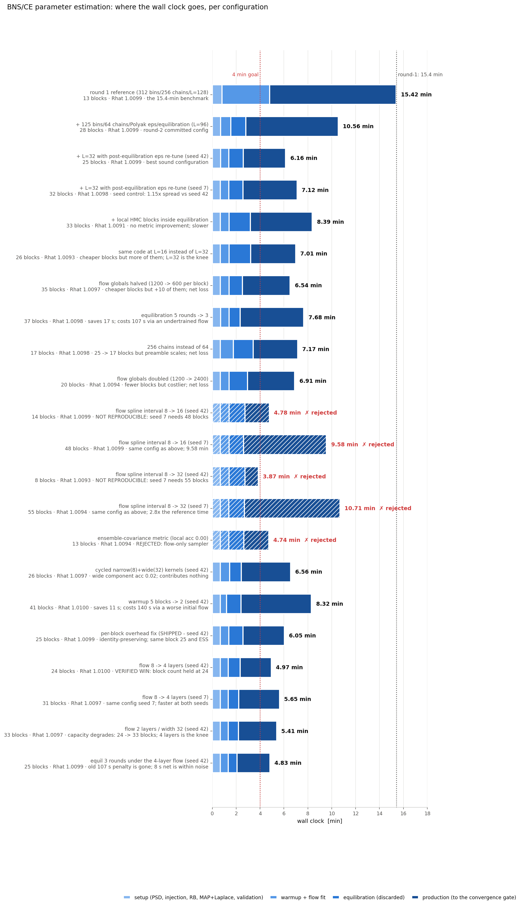
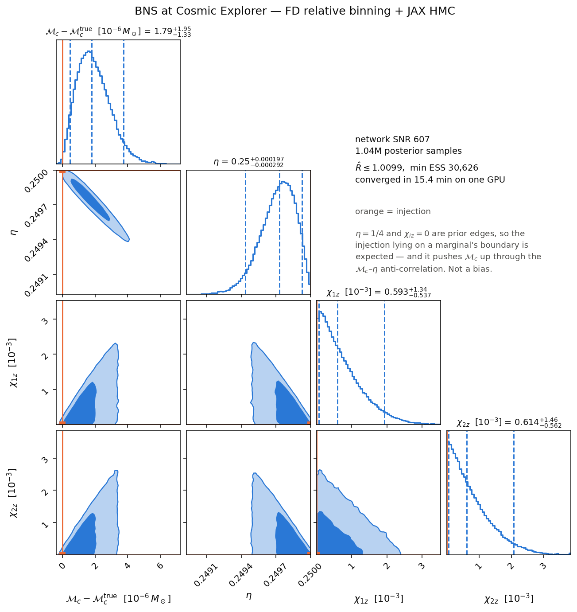
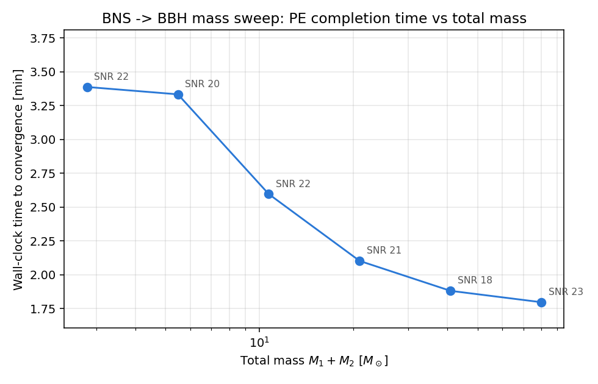
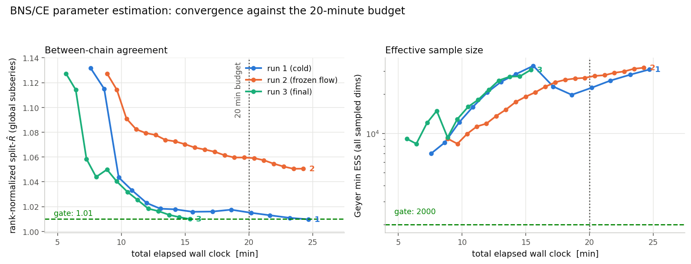

# BNS parameter estimation at Cosmic Explorer, in about three minutes

Driver: [`bin/run_bns_ce_pe.py`](../bin/run_bns_ce_pe.py)

End-to-end parameter estimation on a binary-neutron-star injection as a
next-generation detector would see it: m1 = m2 = 1.4 M☉, zero spins, f_lower = 10 Hz,
4096 Hz sampling, zero-noise data in a single detector with the Cosmic Explorer
P1600143 PSD. Network SNR 607, with a ~1000 s inspiral in band. Four parameters are
sampled — chirp mass, η, and both aligned spins — with uniform priors and extrinsics
fixed. The likelihood is frequency-domain relative binning; the sampler is jaxpe's HMC
with a dense mass matrix, interleaved with normalizing-flow global proposals.

**Result: 3.11 min mean wall clock on one Quadro T2000 Max-Q**, converged to
rank-normalized split-R̂ < 1.01, verified across three random seeds:

| seed | production blocks | R̂ | min ESS | wall clock |
|---|---|---|---|---|
| 42 | 25 | 1.0092 | 9 463 | 3.49 min |
| 7 | 22 | 1.0097 | 14 795 | 2.95 min |
| 13 | 21 | 1.0095 | 18 919 | 2.89 min |

That is down from **15.42 min** when this benchmark first met its original 20-minute
target — a 5× improvement. Reproduce with:

```bash
python bin/run_bns_ce_pe.py          # run twice: the second is compile-free
```

All timings assume a warm persistent XLA cache (`~/.cache/jaxpe_xla`), which the first
invocation populates. Compilation is excluded deliberately; it is a one-off, and
including it measures the compiler rather than the sampler.



Where the 209 s of the seed-42 run goes: setup 40 s (PSD, injection, relative-binning
summary data, MAP + Laplace, validation), warmup 14 s, flow fit 7 s, equilibration
34 s, production 113 s.

---

## The bug that mattered more than every tuning decision combined

Most of the speedup came from one line in `jaxpe/kernels/base.py`. `run_chains`
initialised its chains like this:

```python
states = jax.vmap(lambda x: kernel.init(x, logp_fn))(x0)   # outside the jit!
```

That `vmap` is not jitted, so every operation in the target's gradient graph was
dispatched to the GPU individually. For a gravitational-wave likelihood that graph is
about 3600 instructions, and the cost is brutal:

| chain initialisation, 64 chains | |
|---|---|
| eager `vmap` (as it was) | **2.215 s** |
| the same work jitted | **0.004 s** |

Roughly 550× — and it was a *fixed* cost, paid on every `run_chains` call regardless of
how many steps that call took. The benchmark makes about 33 such calls per run
(5 warmup + 3 step-size re-tune + 25 production), so something like 74 s of a 290 s run
was this. Initialisation now happens inside `_run_chains_jit`, which already took
`logp_fn` as a static argument, so there is no new jit cache and no extra
recompilation. Every sampler in jaxpe benefits, not just this benchmark.

Two regression tests guard it (`tests/test_kernels.py`): one asserts the target is
never invoked with concrete (untraced) values during `run_chains`, which is the
structural cause rather than a flaky wall-clock threshold; the other asserts that 4× the
steps costs meaningfully more than 1× — a fixed-cost-dominated implementation lands near
parity.

### It had also been quietly corrupting the measurements

This is the uncomfortable part, and the most useful thing on this page. A 2.25 s fixed
cost per call sits inside anything measured on top of it, and it made three conclusions
look solid that were not:

| conclusion, measured under the bug | after the fix |
|---|---|
| halving local steps per block loses (5.27 vs 4.83 min) | **wins**: 3.11 vs 3.74 min mean over three seeds |
| 3 vs 5 equilibration rounds is "within noise" (8 s apart) | 3 rounds wins by 35 s; now the default |
| the per-block cost budget "closes", so no overhead remains | 2.25 s/block of eager dispatch was hiding inside what that sum called gradient work |

The middle one is instructive: halving the local steps could only ever recover 0.65 s of
a 6.6 s block while a fixed 2.25 s was charged per call, so that experiment was rigged
against itself before it started.

What found the bug was switching from *point* measurements to a *scaling* fit. A sum
that balances at one configuration tells you nothing about what happens when the
configuration changes; fitting `T = fixed + marginal × work` across several sizes
exposed a 2.254 s intercept immediately. That profiler is now a committed tool,
[`bin/profile_sampler_scaling.py`](../bin/profile_sampler_scaling.py) — worth running
first on any new hardware, since the interesting question there is *which* costs move.

---

## How the sampler is put together

1. **Setup, CPU-pinned.** CE PSD via `lalsimulation`'s series API; injection over a
   2048 s segment (wrap-free for a ~1000 s inspiral, df = 1/2048 Hz); relative-binning
   summary data compressing 3.75M band points to **125 bins**. The dense grids never
   reach the GPU — on a 4 GB card shared with a desktop they do not fit.
2. **A lean hot log-posterior.** A closure over only the O(n_bins) summary arrays plus
   fixed-extrinsic projection constants, so IMRPhenomD is evaluated at 126 bin edges
   instead of millions of frequencies. Asserted equal to the class implementation at
   machine precision, and validated against the dense likelihood with the β error model
   (bulk |Δ lnL| < 0.1, measured 2.5e-2). Exact-at-fiducial to 1e-8 relative.
3. **MAP + Laplace metric.** Damped Newton with eigenvalue clipping and backtracking —
   monotone, so it cannot leave the fiducial point's basin. Its Hessian becomes the
   dense HMC mass matrix, with soft eigenvalues floored for the boundary directions.
4. **Warmup.** Robbins–Monro step-size adaptation at the production trajectory length,
   averaging log ε over the post-transient blocks. Chains stranded on secondary ripples
   of the oscillatory matched-filter likelihood (Δ lnL ~ −10³) are re-seeded.
5. **Equilibration**, all discarded: flow rounds that spread the chains and bootstrap
   the flow, then a short step-size re-tune against the *equilibrated* positions.
6. **Production.** Local HMC (L = 32) interleaved with 1200 flow independence proposals
   per block, the flow refit every fourth block behind a revert guard.
7. **Convergence gate**, checked per block: rank-normalized split-R̂ over the global
   subseries < 1.01, Geyer min ESS ≥ 2000, and no stuck chains.

### Why this posterior is awkward

The PN phase ties chirp mass, η and the spins into a thin, curved valley — Mc and η are
~97 % anti-correlated. The equal-mass injection puts η exactly on its 0.25 prior edge
and both spins on their 0.0 edge, so in unconstrained (sigmoid) coordinates the soft
directions become Exponential-tailed rather than Gaussian. A single fixed metric cannot
precondition both the needle-thin chirp-mass direction (σ ~ 10⁻⁶ M☉) and those boundary
tails, which is the whole reason there is a flow in the loop.

---

## What actually made it fast

**Re-tune the step size after equilibration, not just during warmup.** Worth
10.56 → 6.2 min on its own. Warmup adapts ε while the chains are still inside a 0.3σ
ball, whose curvature is not the curvature they will later see — measured, that left
production running at 0.94–0.96 acceptance, meaning ε was far too small and almost all
the gradient work was buying no displacement. Three discarded local blocks after
equilibration, targeting the *same* acceptance but evaluated where the chains actually
are, fixes it. This is also what makes short trajectories (L = 32) viable, halving
per-block cost at essentially unchanged block count.

**Halve the flow.** 8 → 4 coupling layers, worth 6.59 → 5.31 min mean. The global block
runs *two* flow passes per proposal (`sample` and `log_prob`), which dominates it:
3.38 s per 1200-step block at 8 layers, of which only 0.61 s is the likelihood. Eight
layers is generous for a four-dimensional posterior, and this is the rare change that is
a pure win rather than a trade — block count unchanged, acceptance *improved*
(0.40 → 0.59), faster at both seeds tested, no variance inflation. Four layers is the
knee: at two layers the capacity genuinely degrades and the block count jumps 24 → 33.

**Persistent XLA compilation cache.** Setup 3.5 min → 49 s, back in the first round.

**O(n) diagnostics.** R̂ and ESS were recomputed over the whole growing sample stack
every block, which is O(n²) across a run. Each block is now decimated on arrival and
mapped to physical space once, and the global block is fetched from the device once
instead of three times. Worth ~8 s — real, but a quarter of what the visible-looking
redundancy suggested.

**Fewer chains than you would guess.** Per-step cost is strongly sublinear in chains
(32 → 1024 chains is 32× the work for 5× the time), so at 64 chains the GPU is
latency-bound, not throughput-bound. 64 chains give ~2.4× more per-chain steps per
second than 256, and R̂ depends on per-chain length.

---

## What did not work

Kept because they carve the design space — and because several were only *later* shown
to have failed for measurement reasons rather than physical ones.

| tried | outcome |
|---|---|
| **float32** | 3× faster and wrong. A BNS inspiral from 10 Hz accumulates ~10⁵ radians of phase; f32's ~7 significant digits leave ~0.01 rad, and the exact-at-fiducial check returned lnL = −34 instead of 0. The coalescence-time phase *can* be cancelled analytically (t_c is fixed, so it divides out of the heterodyne ratio) but the intrinsic phase cannot. |
| **Widening the flow's spline interval** | A variance trap. Outside its `interval` the RQ-spline is the identity, so wider proposals do reach the Exponential boundary tails — best case 3.87 min. But acceptance collapses (0.55 → 0.36 → 0.09), and at ~0.1 acceptance convergence becomes a lottery: the same configuration took 10.71 min at another seed. Mean over two seeds is *worse* than the default, with a 2.75× spread against 1.15×. |
| **Cycling narrow + wide flow kernels** | Exact (each sub-block is posterior-invariant, so their composition is too) and useless: the wide component accepts at 0.02, contributing nothing while consuming half the proposals and an extra flow fit. |
| **Ensemble covariance as the mass matrix** | Local acceptance goes to exactly 0.00. The equilibration ensemble is ~40× over-dispersed in the chirp-mass direction, which is five orders of magnitude tighter than the others, so every trajectory leaves the ridge. One such run hit 4.74 min and was rejected as a flow-only sampler. |
| **Longer trajectories at fixed ε** | Acceptance collapses to 0.03–0.19: ε does not transfer across trajectory lengths, because leapfrog energy error accumulates along the trajectory. |
| **More chains (256)** | Four times the flow training data really does cut block count 25 → 17, but per-block cost rises in step and the whole loss is *preamble*: warmup and equilibration run a fixed number of steps, so their cost scales with chains while their benefit does not. |
| **More flow proposals (2400)** | Fewer blocks, costlier blocks, net loss. |
| **Trimming warmup to 2 blocks** | Saves 11 s, costs 140 s. Warmup's real job is not ε adaptation — the post-equilibration re-tune does that — it is supplying the flow's *first* training set. With 2 blocks the fit degrades from loss 0.206 to 0.681. |
| **Trimming the MAP search** | 24 → 12 Newton steps saved 5 s of setup and cost ~350 s of sampling via a worse metric. |
| **Adam to find the MAP** | Leaves the basin entirely (lnL −1.2e5): normalized steps are far larger than the σ ~ 10⁻⁶ chirp-mass needle. |
| **Freezing the flow once acceptance looks healthy** | A mediocre frozen flow never improves; R̂ stalled at 1.05 for 21 blocks. Keep refitting, but retain the previous flow and revert if acceptance collapses. |

### A soundness rule, learned the hard way

**A configuration only counts if the local HMC kernel has non-zero acceptance in
production.** Two separate configurations reached attractive wall-clock numbers by
silently killing the gradient kernel and converging as pure flow-driven independence
samplers. They pass R̂ and ESS. They are not what this benchmark measures, and their
timings are not comparable.

### And a rule about measurement

Several negatives above were re-tested after conditions changed, and **seven of them
reversed.** The recurring error was treating a measurement as a property of the
*problem* when it was a property of the *configuration it was taken in*. Concretely:
"short trajectories starve the flow" was true at a fixed step size and false once ε was
re-tuned; "halving local steps loses" was true under a fixed per-call cost and false
without it. Re-measuring stale negatives was by far the highest-yield habit in this
whole exercise — including the one that produced the final result.

Related: a single-seed timing is not a measurement when acceptance is low. The 3.87 min
figure above was committed as a result and retracted a few minutes later when the same
configuration took 10.71 min at another seed. Differences below ~15 % between two
single-seed runs on this problem are not resolved by the data.

---

## Correctness

The fast configuration is compared to the 15.4-minute reference sample-set to
sample-set with [`bin/compare_bns_posteriors.py`](../bin/compare_bns_posteriors.py):

| comparison | worst JS | worst median shift |
|---|---|---|
| reference vs shipped configuration | 5.2e-3 | 0.046 σ |
| **control: two independent runs of the same configuration** | **4.6e-3** | 0.047 σ |

The control is the point: re-running the sampler moves the posterior about as much as
any of these changes do. The 5.2e-3 sits marginally *above* that floor rather than
comfortably below it — the same order as sampler noise, and well under the 1e-2
acceptance threshold. (The 1e-3 figure quoted in the relative-binning status page
belongs to a deterministic grid comparison with no Monte Carlo noise and does not
transfer to sample-based comparisons at these sizes.)



Median chirp mass 1.2187730 M☉ against an injected 1.2187707 — a measurement to roughly
one part in 10⁶, which is what SNR 607 over a ~1000 s inspiral buys. Chirp mass is drawn
as an offset from the injection because its posterior is only ~10⁻⁶ M☉ wide.

**The marginals are one-sided about the truth by construction, not biased.** Truth
recovery comes out at +1.84 σ in chirp mass, −1.86 σ in η and ~+1 σ in both spins, and
those same offsets appear in the 15.4-minute reference. The injection sits exactly on
the η = 0.25 prior boundary; Mc and η are ~97 % anti-correlated, so truncating η from
above truncates Mc from below. The spin panels show the expected χ_eff degeneracy
triangle — only the mass-weighted combination is measured, so the individual spins slide
along the anti-diagonal until the positive-support priors cut them off, which pushes
their medians above zero and η's below its truth.

### Nothing is tuned to this source

A standing constraint on this work: no per-binary tuning, and **no changes to the physics
of the templates** — no dropping waveform content, no reduced-frequency-content
approximations, no reduced precision in template evaluation. Every timing on this page
evaluates the full three-region IMRPhenomD in float64. All the speedups are
sampler-side; in particular the flow supplies Metropolis–Hastings proposals, so the
target density is preserved exactly however good or bad the flow happens to be.

Component masses are `--mass1/--mass2`, η's truth follows from them, priors and the
optimiser start are derived at runtime, and every adaptation is driven by measured
acceptance. Verified by rerunning a **1.35 + 1.25 M☉** injection with no retuning: it
converges (R̂ 1.0097, chirp mass recovered exactly, same boundary signature), picks its
own step sizes, and passes relative-binning parity on its own waveform.

The *configuration* carries over; the *wall clock* does not. That source needs 41 blocks
and ~5.0 min rather than 25 and 3.5 min — it is simply a harder posterior, and it needed
proportionally more blocks under every earlier configuration too. Its η truth sits just
*inside* the prior edge (0.24963) rather than exactly on it, trading a pinned corner for
a genuinely curved two-dimensional ridge.

One related defect, found and fixed: `--max-production-blocks` defaulted to 40, which
the unequal-mass run hit at R̂ = 1.0107 and therefore reported as *not converged*. It
needed 42. A cap that turns "needs slightly longer" into "failed" is measuring the cap;
`--max-minutes` is the real budget guard, and the default is now 80.

### Beyond BNS: a mass sweep to 80 M☉

The 1.35 + 1.25 M☉ check above verifies the configuration survives a *slightly*
unequal BNS. [`bin/run_mass_sweep_pe.py`](../bin/run_mass_sweep_pe.py) pushes the same
question much further: six equal-mass injections, log-spaced in total mass from 2.8 M☉
(BNS) to 80 M☉ (BBH), each run unmodified through this page's exact HMC + flow pipeline
via `run_bns_ce_pe.py` — same code, same defaults, only `--mass1/--mass2`, segment
duration, and distance change per injection. Duration is sized per injection from
LALSimulation's own chirp/merger/ringdown time bounds rather than reusing 2048 s
everywhere (a 40+40 M☉ signal is in band for ~5 s from 10 Hz); distance is solved to a
comparable-but-not-identical network SNR (~18–23) via the exact 1/D scaling now exposed
as `--target-snr` on `run_bns_ce_pe.py` itself.

| M_tot (M☉) | SNR | duration | time to converge | R̂_max | min ESS |
|---:|---:|---:|---:|---:|---:|
| 2.80 (BNS) | 21.6 | 2048 s | 3.39 min | 1.0098 | 9,492 |
| 5.47 | 19.6 | 512 s | 3.33 min | 1.0097 | 12,617 |
| 10.70 | 22.2 | 256 s | 2.60 min | 1.0092 | 12,185 |
| 20.93 | 21.2 | 64 s | 2.10 min | 1.0099 | 9,741 |
| 40.92 | 17.6 | 32 s | 1.88 min | 1.0074 | 10,833 |
| 80.00 (BBH) | 22.9 | 8 s | 1.80 min | 1.0096 | 14,623 |



All six converge on the same R̂/ESS gate as everywhere else on this page, and completion
time falls **monotonically** with mass, 3.39 → 1.80 min, rather than growing or
non-monotonically wandering. That is the expected direction — higher mass means a
shorter segment and fewer relative-binning bins, so it is cheaper per gradient, not just
per second of data — but it was an assumption in the "What is left" section below until
this sweep measured it. It is not proof the sampler's *hyperparameters* (flow spline
interval, equilibration rounds, ...) are optimal all the way to 80 M☉, only that the
BNS-tuned defaults, left untouched, still reach the same convergence gate there.

Raw sweep output: [`mass_sweep_summary.csv`](assets/mass_sweep_summary.csv); figure via
`python bin/plot_mass_sweep_timing.py <sweep_summary.csv>`.

---

## What is left, if you want to go further

Production is still ~55 % of the run, and the dominant term is the IMRPhenomD gradient
itself: a long serial dependency chain (~3600 instructions, 5 fusions) whose cost is
sublinear in chains and nearly flat in bin count. Trajectory length is at its measured
knee, the flow is at its measured knee, and both halves of the preamble are load-bearing
in both directions.

- **Different hardware.** fp64 throughput is what matters here, and it is *not* a
  professional-versus-consumer distinction: the T2000 and the A40 both run fp64 at 1/32
  of fp32. A100/H100-class parts (1/2 rate) are the ones that change this arithmetic. A
  larger card also lifts the 4 GB constraint that forces setup onto the CPU, and makes
  large chain counts cheap enough to be worth revisiting.
- **A cheaper exact gradient**, e.g. a reduced-order or surrogate waveform. That is a
  different accuracy contract from trimming PhenomD and needs its own validation.
- **Skipping unused waveform regions** is *ruled out*, not deferred. `Phase`/`Amp`
  evaluate all three frequency regions and select with heaviside masks, and JAX
  evaluates both sides of a `where`. Timed end to end, eliminating the unused ones caps
  out at ~6 % of the run — the 4× HLO instruction-count ratio badly overstates it,
  because those instructions are cheap elementwise work over 126 points. Not worth
  editing a 4000-line waveform module for, and it falls under the template constraint
  regardless.

---

## Reproducing the figures

```bash
python bin/make_bns_ce_figures.py     # reads examples/output/bns_ce_rb_hmc/
```

[`bin/make_bns_ce_figures.py`](../bin/make_bns_ce_figures.py) rebuilds all three figures
from run artefacts, so every number on the axes traces back to a measurement rather than
to this page. The convergence series and the per-configuration stage timings are cached
to [`bns_ce_convergence.csv`](assets/bns_ce_convergence.csv) and
[`bns_ce_speed_stages.csv`](assets/bns_ce_speed_stages.csv) — raw run logs fall under the
repository's `*.log` ignore, so those CSVs are the committed evidence and the figures
regenerate from a clean checkout. The corner plot needs `samples.npz` (~1–2M × 4
float64, deliberately untracked); rerun the PE to regenerate it.



This figure is from the original 20-minute-budget round and is kept for the failure mode
it captures: the run that froze its flow (middle series) kept accumulating ESS at a
healthy rate while R̂ plateaued near 1.05 and never converged. That divergence between
ESS and R̂ is the signature of a proposal that produces samples but does not move chains
between the boundary tails.

## Notes

- The maximum sampled log-posterior (−15.48) exceeds the damped-Newton "MAP" (−18.14).
  There is no sharp finite mode: the boundary directions are flat until the sigmoid
  Jacobian turns over, so Newton stops early on a plateau. This affects only where the
  preconditioner is centred, and production acceptance of 0.7–0.8 says the metric is
  fine.
- Diagnostics use the **global subseries** for R̂ because plain split-R̂ over the raw
  autocorrelated series asymptotes at √(1 + 4τ/n) — it re-measures within-chain
  autocorrelation and would need ~400τ samples to certify 1.01. The raw value is
  reported alongside for reference.
- Profile on the backend you actually run on. Diagnostics timed under
  `JAX_PLATFORMS=cpu` do not bound the same code on the GPU, and a standalone
  `vmap(grad(loglike))` differs measurably from the same gradient inside a `scan` over an
  HMC trajectory (3.2 vs 4.5 ms here) — the standalone figure is the one that misled.
