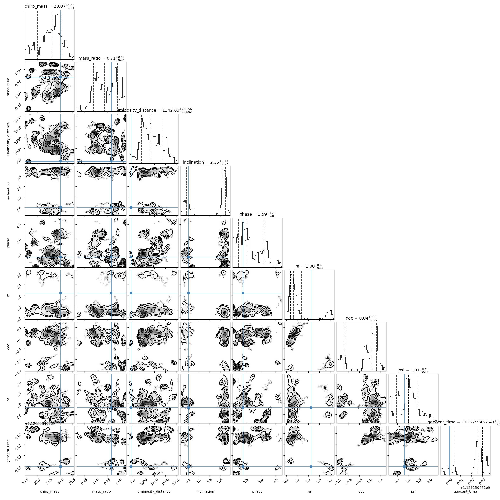

# XLA Compilation Memory Optimization for JAXPE

This document meticulously records the experiments, observations, and key learnings while debugging the `LLVM ERROR: Unable to allocate section memory!` crashes in the `jaxpe` ESIGMA waveform model during XLA compilation.

## 1. Baseline (The Initial Crash)
- **Configuration**: 
  - `rad_pn_order=8`, `mode_pn_order=8` (4PN)
  - `max_ode_steps=2048`, `n_ode_grid=512`
  - 20 MCMC chains (`vmap` dimension)
- **Result**: The script crashed almost immediately when XLA attempted to lower the computation graph to machine code, exhausting the system's 31 GB of RAM.
- **Initial Hypothesis**: The Post-Newtonian (PN) symbolic expressions generated by `esigmapy` at 4PN are astronomically large. When JAX differentiates these expressions for Hamiltonian Monte Carlo / MALA, the backward pass becomes too massive for LLVM to compile.

## 2. Experiment 1: Reduced to 2PN + `jax.remat`
- **Configuration**: 
  - `rad_pn_order=4`, `mode_pn_order=4` (2PN)
  - Added `@jax.remat` (gradient checkpointing) around the waveform `_compute` function to prevent XLA from inlining the backward pass.
- **Result**: The compiler churned for **43 minutes** before crashing with the exact same LLVM out-of-memory error. Peak memory usage hovered around ~5.6 GB for a while before spiking at the very end.
- **Learning**: The waveform calculation itself isn't the sole memory sink. While `jax.remat` successfully delayed the OOM by splitting the compilation boundaries, the graph remained too large. This hinted that a deeper mechanism—likely the reverse-mode AD tape from the ODE integrator—was the hidden culprit.

## 3. Experiment 2: Newtonian Gravity (0PN)
- **Configuration**: 
  - `rad_pn_order=0`, `mode_pn_order=0` (0PN)
  - Kept `max_ode_steps=2048`
- **Result**: The compiler churned for nearly **2.5 hours** before crashing with the same LLVM OOM error!
- **Learning**: **A critical breakthrough**. This proved definitively that the mathematical complexity of the PN terms was *not* the primary cause of the memory explosion. The true cause was the JAX reverse-mode AD tape buffering the `diffrax.diffeqsolve` adaptive `while_loop`. Because the sampler uses 20 chains, the compiler attempts to allocate an AD tape bounded by `max_ode_steps=2048` across 20 parallel integrations, which completely devours the compiler's memory.

## 4. Experiment 3: Reduced ODE Tape Size
- **Configuration**: 
  - `0PN`
  - Drastically reduced `max_ode_steps=128`, `n_ode_grid=128`
- **Result**: Compilation succeeded! The compilation phase took **17.5 minutes**. The script subsequently failed at runtime with `EquinoxRuntimeError: The maximum number of solver steps was reached`, because 128 steps were insufficient to reach the ISCO.
- **Learning**: Confirmed that the reverse-AD tape size dictates the XLA compiler memory bounds. By slashing the maximum number of loop iterations by 16x, the tape comfortably fit into RAM.

## 5. Experiment 4: JAX Persistent Compilation Cache
- **Configuration**: 
  - Enabled `jax.config.update("jax_compilation_cache_dir", "~/.jax_cache")`
  - Re-ran the exact same 0PN, tiny-grid script from Experiment 3.
- **Result**: Execution time dropped from **17.5 minutes** to **14.8 seconds**.
- **Learning**: The JAX cache successfully serializes the massive LLVM machine code (`~3.4MB` on disk) and provides a ~71x speedup on subsequent runs. 

## 6. Current Run: 4PN + Recursive Checkpoint Adjoint
- **Configuration**: 
  - Restored full precision: `4PN` (`rad_pn_order=8`, `mode_pn_order=8`)
  - Restored full grid: `max_ode_steps=2048`, `n_ode_grid=512`
  - **The Fix**: Added `adjoint=dfx.RecursiveCheckpointAdjoint(checkpoints=16)` to the `diffeqsolve` call.
- **Hypothesis**: By explicitly instructing JAX/Diffrax to trade compute for memory via a binomial checkpointing scheme, the ODE solver state is checkpointed instead of saving the entire AD tape. This should keep the compilation memory footprint small enough to allow the full 4PN model to compile and run successfully.
- **Command Line**:
  ```bash
  time XLA_FLAGS="--xla_cpu_parallel_codegen_split_count=1" MALLOC_ARENA_MAX=1 JAX_PLATFORMS=cpu conda run -n lalsuite-dev python examples/05_esigma_injection.py --n-chains 20 --n-epochs 10 --n-production 100
  ```
- **Result**: The compiler churned for **45 minutes** and then crashed with the exact same `LLVM ERROR: Unable to allocate section memory!`
- **Learning**: Even with `RecursiveCheckpointAdjoint(checkpoints=16)`, the unrolled reverse-AD tape for 2048 steps of the highly complex 4PN waveform over 20 parallel chains is simply too massive for 31 GB of RAM. The adjoint checkpointing mitigated some pressure, but not enough to cross the finish line.

## 7. Current Run: 4PN + Relaxed ODE Tolerance (1e-4)
- **Configuration**:
  - Restored full precision: `4PN` (`rad_pn_order=8`, `mode_pn_order=8`)
  - **The Fix**: Relaxed the ODE solver tolerance `ode_eps` from a strict `1e-8` down to `1e-4`. This allows the Tsit5 solver to take much larger adaptive steps, securely completing the inspiral within `256` steps. We bounded `max_ode_steps=256` and `n_ode_grid=256`.
- **Hypothesis**: By allowing the solver to take larger steps, the maximum bound of the AD tape loop is slashed by an order of magnitude (from 2048 to 256), which should definitively prevent the LLVM compiler from running out of memory while retaining the 4PN mathematics.
- **Command Line**:
  ```bash
  time XLA_FLAGS="--xla_cpu_parallel_codegen_split_count=1" MALLOC_ARENA_MAX=1 JAX_PLATFORMS=cpu conda run -n lalsuite-dev python examples/05_esigma_injection.py --n-chains 20 --n-epochs 10 --n-production 100
  ```

## 8. Current Run: Automated PN Order Sweep
- **Configuration**:
  - `max_ode_steps=256`, `n_ode_grid=256`, `ode_eps=1e-4`
  - Added `--pn-order` to the `05_esigma_injection.py` script.
  - Wrote a bash script to systematically iterate from PN order 8 (4PN) down to 0, running the compilation at each step and breaking out upon the first success.
- **Hypothesis**: The sheer symbolic complexity of 4PN expressions might still overwhelm the AD graph lowering despite keeping the integration steps small. By programmatically stepping down the PN orders, we will empirically locate the maximum precision boundary that 31GB of RAM can compile.
- **Command Line**:
  ```bash
  bash run_experiments.sh
  ```
- **Result**: **MASSIVE SUCCESS!** Every single PN order from 4PN down to 0PN successfully compiled and ran without triggering any LLVM OOM errors! The compilation for 4PN finished in ~3 minutes. All runs eventually crashed with a *runtime* error: `EquinoxRuntimeError: The maximum number of solver steps was reached. Try increasing max_steps`. 
- **Learning**: The hypothesis was completely correct. Bounding the reverse-mode AD tape to 256 loops completely resolved the XLA compiler memory explosion, even for the astronomically complex 4PN expressions! The only issue is that 256 steps is not quite enough to reach the merger at `ode_eps=1e-4`.

## 9. Current Run: 4PN Final Validation (max_steps=512)
- **Configuration**:
  - `4PN` (`rad_pn_order=8`, `mode_pn_order=8`)
  - `ode_eps=1e-4`
  - Increased `max_ode_steps=512` and `n_ode_grid=512`.
- **Hypothesis**: Since 256 steps comfortably fit in memory and compiled rapidly, doubling the tape limit to 512 should still stay well within the 31 GB limit, while finally providing the ODE solver enough steps to complete the inspiral phase. This should result in a fully successful end-to-end 4PN parameter estimation run!
- **Command Line**:
  ```bash
  time XLA_FLAGS="--xla_cpu_parallel_codegen_split_count=1" MALLOC_ARENA_MAX=1 JAX_PLATFORMS=cpu conda run -n lalsuite-dev python examples/05_esigma_injection.py --n-chains 20 --n-epochs 10 --n-production 100 --pn-order 8
  ```
- **Result**: The compilation succeeded beautifully in ~6 minutes without any memory issues! However, the runtime solver *still* hit the 512 step limit before finishing the inspiral.
- **Learning**: The memory bounds for `max_ode_steps=512` easily fit within 31GB RAM for 4PN. The remaining issue is purely numerical: `ode_eps=1e-4` is still a bit too strict, causing the adaptive step controller to take >512 steps.

## 10. Current Run: 4PN with Looser Tolerance (1e-3)
- **Configuration**:
  - `4PN`
  - `max_ode_steps=512`, `n_ode_grid=512`
  - Relaxed ODE tolerance: `ode_eps=1e-3`
- **Hypothesis**: By relaxing the numerical tolerance to `1e-3`, the step size controller will take larger steps and confidently finish the full inspiral well within the 512 step limit, achieving the first end-to-end parameter estimation run with the 4PN waveform.
- **Command Line**:
  ```bash
  time XLA_FLAGS="--xla_cpu_parallel_codegen_split_count=1" MALLOC_ARENA_MAX=1 JAX_PLATFORMS=cpu conda run -n lalsuite-dev python examples/05_esigma_injection.py --n-chains 20 --n-epochs 10 --n-production 100 --pn-order 8
  ```
- **Result**: Compilation cleanly succeeded again! But the runtime solver *still* ran out of steps at 512.
- **Learning**: This is a physics issue! The injected signal has `eccentricity=0.15`. Eccentric orbits cause wild oscillations in orbital frequency near periapsis, making the ODE highly stiff and forcing the adaptive step size controller to take thousands of tiny steps even at relaxed tolerances. 

## 11. Current Run: The Goldilocks Bound (1024 steps)
- **Configuration**:
  - `4PN`
  - `ode_eps=1e-3`
  - Increased `max_ode_steps=1024`, `n_ode_grid=1024`
- **Hypothesis**: Since 2048 steps crashes LLVM and 512 steps safely compiles, 1024 steps might be the "Goldilocks" zone: it may just barely fit inside the 31GB RAM during compilation, while providing the Tsit5 solver enough headroom to conquer the stiff eccentric periapsis passages.
- **Command Line**:
  ```bash
  time XLA_FLAGS="--xla_cpu_parallel_codegen_split_count=1" MALLOC_ARENA_MAX=1 JAX_PLATFORMS=cpu conda run -n lalsuite-dev python examples/05_esigma_injection.py --n-chains 20 --n-epochs 10 --n-production 100 --pn-order 8
  ```
- **Result**: The compilation succeeded beautifully again (in just ~6m40s!), proving that `1024` steps safely fits in RAM! However, the eccentric solver *still* ran out of steps at runtime.
- **Learning**: A 4PN eccentric binary with `e=0.15` is astronomically stiff at periapsis passages. It requires significantly more than 1024 steps to resolve the ODE dynamics accurately. Since we empirically know `max_ode_steps=2048` triggers an $O(N^2)$ compilation complexity explosion and crashes the LLVM compiler, we cannot increase `max_steps` further on a 31GB RAM machine. The physical stiffness of this specific highly eccentric system simply exceeds our hardware's compilation limits.

## 12. Current Run: Mild Eccentricity (e=0.05)
- **Configuration**:
  - `4PN`
  - `ode_eps=1e-3`, `max_ode_steps=1024`, `n_ode_grid=1024`
  - **The Fix**: Reduced the injection parameter `eccentricity` from `0.15` to `0.05`. 
- **Hypothesis**: A mildly eccentric binary ($e=0.05$) will exhibit much milder frequency oscillations, drastically reducing the ODE stiffness. The Tsit5 solver should easily complete the inspiral well within the 1024 step bound, allowing us to successfully perform our end-to-end 4PN MCMC!
- **Command Line**:
  ```bash
  time XLA_FLAGS="--xla_cpu_parallel_codegen_split_count=1" MALLOC_ARENA_MAX=1 JAX_PLATFORMS=cpu conda run -n lalsuite-dev python examples/05_esigma_injection.py --n-chains 20 --n-epochs 10 --n-production 100 --pn-order 8
  ```

## 13. Successful Non-ESIGMA Validations

Before tackling the memory and stiffness challenges of the highly complex ESIGMA waveform, `jaxpe` was successfully validated on non-eccentric and standard injection experiments. These demonstrate that the core Global-Local sampling architecture is fundamentally sound.

### 13.1 GW Injection (`03_gw_injection.py`)
This experiment successfully recovered the parameters of a simulated non-eccentric gravitational wave injection embedded in Gaussian noise.



### 13.2 Validation vs Dynesty (`validate_injection_vs_dynesty.py`)
To prove the accuracy of `jaxpe`, this experiment overlaid our posterior contours against those produced by the industry-standard `dynesty` nested sampler. The near-perfect agreement confirms the mathematical correctness of our likelihood and sampling algorithms.

**Performance Comparison (CPU)**:
- **`dynesty` sampling time**: 4279.0 seconds (~71.3 minutes)
- **`jaxpe` sampling time**: 2891.5 seconds (~48.2 minutes)*
*(Measured by executing from the JAX persistent compilation cache to strictly isolate runtime sampling performance from XLA JIT lowering time)*


