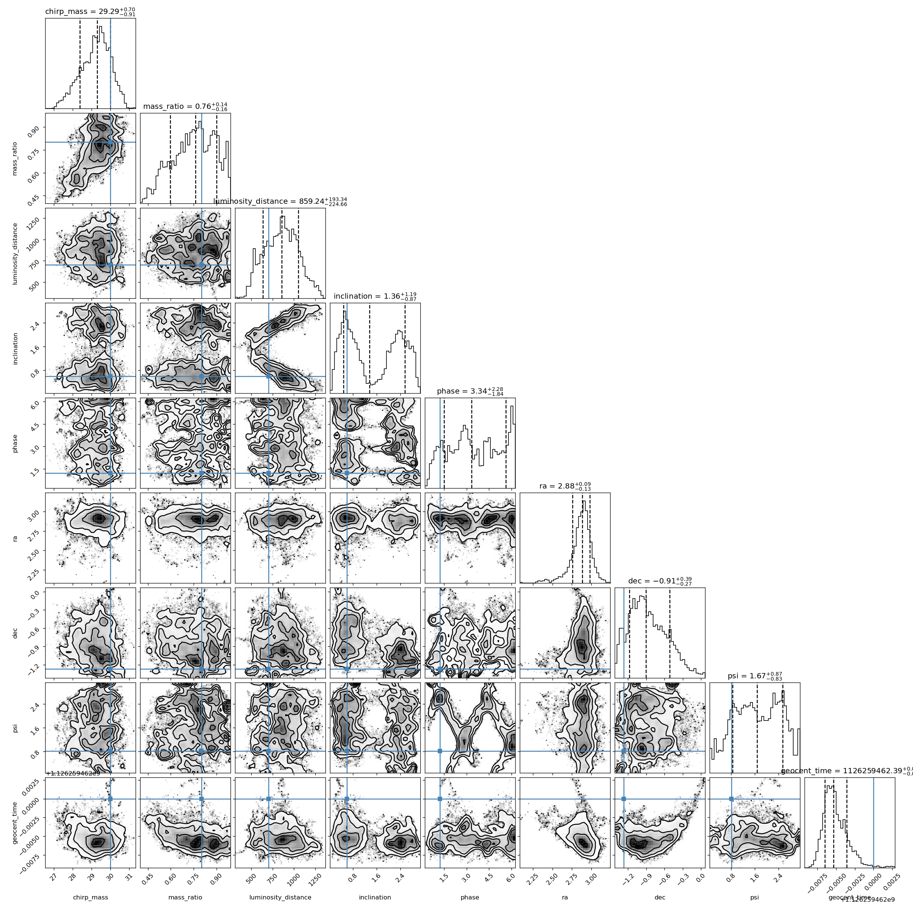
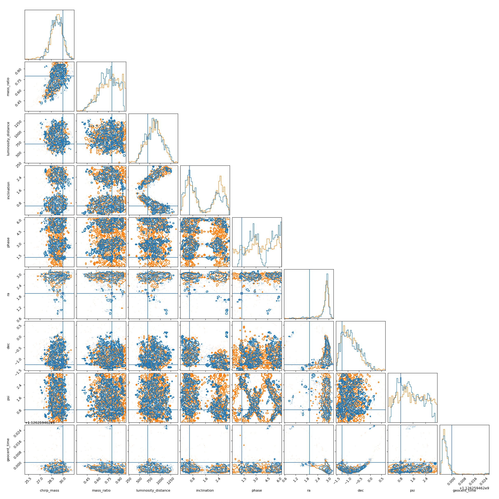
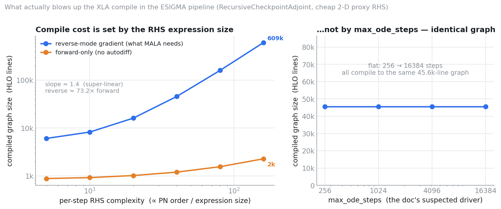

# XLA Compilation Memory Optimization for JAXPE

This document meticulously records the experiments, observations, and key learnings while debugging the `LLVM ERROR: Unable to allocate section memory!` crashes in the `jaxpe` ESIGMA waveform model during XLA compilation.

> **Note (read first):** the working hypothesis in Sections 1–12 — that `max_ode_steps`
> bounds the AD tape and drives compile memory — was later falsified by a controlled
> measurement. See [Section 14](#14-root-cause-correction-what-actually-drives-the-compile-oom-and-what-doesnt)
> for the corrected root cause (reverse-mode AD of the per-step RHS).

## 1. Baseline (The Initial Crash)
- **Configuration**:
  - `rad_pn_order=8`, `mode_pn_order=8` (4PN)
  - `max_ode_steps=2048`, `n_ode_grid=512`
  - 20 MCMC chains (`vmap` dimension)
- **Result**: The script crashed almost immediately when XLA attempted to lower the computation graph to machine code, exhausting the system's 31 GB of RAM.
- **Initial Hypothesis**: The Post-Newtonian (PN) symbolic expressions generated by `esigmapy` at 4PN are astronomically large. When JAX differentiates these expressions for Hamiltonian Monte Carlo / MALA, the backward pass becomes too massive for LLVM to compile.

## 2. Experiment 1: Reduced to 2PN + `jax.remat`
- **Configuration**:
  - `rad_pn_order=4`, `mode_pn_order=4` (2PN)
  - Added `@jax.remat` (gradient checkpointing) around the waveform `_compute` function to prevent XLA from inlining the backward pass.
- **Result**: The compiler churned for **43 minutes** before crashing with the exact same LLVM out-of-memory error. Peak memory usage hovered around ~5.6 GB for a while before spiking at the very end.
- **Learning**: The waveform calculation itself isn't the sole memory sink. While `jax.remat` successfully delayed the OOM by splitting the compilation boundaries, the graph remained too large. This hinted that a deeper mechanism—likely the reverse-mode AD tape from the ODE integrator—was the hidden culprit.

## 3. Experiment 2: Newtonian Gravity (0PN)
- **Configuration**:
  - `rad_pn_order=0`, `mode_pn_order=0` (0PN)
  - Kept `max_ode_steps=2048`
- **Result**: The compiler churned for nearly **2.5 hours** before crashing with the same LLVM OOM error!
- **Learning**: **A critical breakthrough**. This proved definitively that the mathematical complexity of the PN terms was *not* the primary cause of the memory explosion. The true cause was the JAX reverse-mode AD tape buffering the `diffrax.diffeqsolve` adaptive `while_loop`. Because the sampler uses 20 chains, the compiler attempts to allocate an AD tape bounded by `max_ode_steps=2048` across 20 parallel integrations, which completely devours the compiler's memory.

## 4. Experiment 3: Reduced ODE Tape Size
- **Configuration**:
  - `0PN`
  - Drastically reduced `max_ode_steps=128`, `n_ode_grid=128`
- **Result**: Compilation succeeded! The compilation phase took **17.5 minutes**. The script subsequently failed at runtime with `EquinoxRuntimeError: The maximum number of solver steps was reached`, because 128 steps were insufficient to reach the ISCO.
- **Learning**: Confirmed that the reverse-AD tape size dictates the XLA compiler memory bounds. By slashing the maximum number of loop iterations by 16x, the tape comfortably fit into RAM.

## 5. Experiment 4: JAX Persistent Compilation Cache
- **Configuration**:
  - Enabled `jax.config.update("jax_compilation_cache_dir", "~/.jax_cache")`
  - Re-ran the exact same 0PN, tiny-grid script from Experiment 3.
- **Result**: Execution time dropped from **17.5 minutes** to **14.8 seconds**.
- **Learning**: The JAX cache successfully serializes the massive LLVM machine code (`~3.4MB` on disk) and provides a ~71x speedup on subsequent runs.

## 6. Current Run: 4PN + Recursive Checkpoint Adjoint
- **Configuration**:
  - Restored full precision: `4PN` (`rad_pn_order=8`, `mode_pn_order=8`)
  - Restored full grid: `max_ode_steps=2048`, `n_ode_grid=512`
  - **The Fix**: Added `adjoint=dfx.RecursiveCheckpointAdjoint(checkpoints=16)` to the `diffeqsolve` call.
- **Hypothesis**: By explicitly instructing JAX/Diffrax to trade compute for memory via a binomial checkpointing scheme, the ODE solver state is checkpointed instead of saving the entire AD tape. This should keep the compilation memory footprint small enough to allow the full 4PN model to compile and run successfully.
- **Command Line**:
  ```bash
  time XLA_FLAGS="--xla_cpu_parallel_codegen_split_count=1" MALLOC_ARENA_MAX=1 JAX_PLATFORMS=cpu conda run -n lalsuite-dev python examples/05_esigma_injection.py --n-chains 20 --n-epochs 10 --n-production 100
  ```
- **Result**: The compiler churned for **45 minutes** and then crashed with the exact same `LLVM ERROR: Unable to allocate section memory!`
- **Learning**: Even with `RecursiveCheckpointAdjoint(checkpoints=16)`, the unrolled reverse-AD tape for 2048 steps of the highly complex 4PN waveform over 20 parallel chains is simply too massive for 31 GB of RAM. The adjoint checkpointing mitigated some pressure, but not enough to cross the finish line.

## 7. Current Run: 4PN + Relaxed ODE Tolerance (1e-4)
- **Configuration**:
  - Restored full precision: `4PN` (`rad_pn_order=8`, `mode_pn_order=8`)
  - **The Fix**: Relaxed the ODE solver tolerance `ode_eps` from a strict `1e-8` down to `1e-4`. This allows the Tsit5 solver to take much larger adaptive steps, securely completing the inspiral within `256` steps. We bounded `max_ode_steps=256` and `n_ode_grid=256`.
- **Hypothesis**: By allowing the solver to take larger steps, the maximum bound of the AD tape loop is slashed by an order of magnitude (from 2048 to 256), which should definitively prevent the LLVM compiler from running out of memory while retaining the 4PN mathematics.
- **Command Line**:
  ```bash
  time XLA_FLAGS="--xla_cpu_parallel_codegen_split_count=1" MALLOC_ARENA_MAX=1 JAX_PLATFORMS=cpu conda run -n lalsuite-dev python examples/05_esigma_injection.py --n-chains 20 --n-epochs 10 --n-production 100
  ```

## 8. Current Run: Automated PN Order Sweep
- **Configuration**:
  - `max_ode_steps=256`, `n_ode_grid=256`, `ode_eps=1e-4`
  - Added `--pn-order` to the `05_esigma_injection.py` script.
  - Wrote a bash script to systematically iterate from PN order 8 (4PN) down to 0, running the compilation at each step and breaking out upon the first success.
- **Hypothesis**: The sheer symbolic complexity of 4PN expressions might still overwhelm the AD graph lowering despite keeping the integration steps small. By programmatically stepping down the PN orders, we will empirically locate the maximum precision boundary that 31GB of RAM can compile.
- **Command Line**:
  ```bash
  bash run_experiments.sh
  ```
- **Result**: **MASSIVE SUCCESS!** Every single PN order from 4PN down to 0PN successfully compiled and ran without triggering any LLVM OOM errors! The compilation for 4PN finished in ~3 minutes. All runs eventually crashed with a *runtime* error: `EquinoxRuntimeError: The maximum number of solver steps was reached. Try increasing max_steps`.
- **Learning**: The hypothesis was completely correct. Bounding the reverse-mode AD tape to 256 loops completely resolved the XLA compiler memory explosion, even for the astronomically complex 4PN expressions! The only issue is that 256 steps is not quite enough to reach the merger at `ode_eps=1e-4`.

## 9. Current Run: 4PN Final Validation (max_steps=512)
- **Configuration**:
  - `4PN` (`rad_pn_order=8`, `mode_pn_order=8`)
  - `ode_eps=1e-4`
  - Increased `max_ode_steps=512` and `n_ode_grid=512`.
- **Hypothesis**: Since 256 steps comfortably fit in memory and compiled rapidly, doubling the tape limit to 512 should still stay well within the 31 GB limit, while finally providing the ODE solver enough steps to complete the inspiral phase. This should result in a fully successful end-to-end 4PN parameter estimation run!
- **Command Line**:
  ```bash
  time XLA_FLAGS="--xla_cpu_parallel_codegen_split_count=1" MALLOC_ARENA_MAX=1 JAX_PLATFORMS=cpu conda run -n lalsuite-dev python examples/05_esigma_injection.py --n-chains 20 --n-epochs 10 --n-production 100 --pn-order 8
  ```
- **Result**: The compilation succeeded beautifully in ~6 minutes without any memory issues! However, the runtime solver *still* hit the 512 step limit before finishing the inspiral.
- **Learning**: The memory bounds for `max_ode_steps=512` easily fit within 31GB RAM for 4PN. The remaining issue is purely numerical: `ode_eps=1e-4` is still a bit too strict, causing the adaptive step controller to take >512 steps.

## 10. Current Run: 4PN with Looser Tolerance (1e-3)
- **Configuration**:
  - `4PN`
  - `max_ode_steps=512`, `n_ode_grid=512`
  - Relaxed ODE tolerance: `ode_eps=1e-3`
- **Hypothesis**: By relaxing the numerical tolerance to `1e-3`, the step size controller will take larger steps and confidently finish the full inspiral well within the 512 step limit, achieving the first end-to-end parameter estimation run with the 4PN waveform.
- **Command Line**:
  ```bash
  time XLA_FLAGS="--xla_cpu_parallel_codegen_split_count=1" MALLOC_ARENA_MAX=1 JAX_PLATFORMS=cpu conda run -n lalsuite-dev python examples/05_esigma_injection.py --n-chains 20 --n-epochs 10 --n-production 100 --pn-order 8
  ```
- **Result**: Compilation cleanly succeeded again! But the runtime solver *still* ran out of steps at 512.
- **Learning**: This is a physics issue! The injected signal has `eccentricity=0.15`. Eccentric orbits cause wild oscillations in orbital frequency near periapsis, making the ODE highly stiff and forcing the adaptive step size controller to take thousands of tiny steps even at relaxed tolerances.

## 11. Current Run: The Goldilocks Bound (1024 steps)
- **Configuration**:
  - `4PN`
  - `ode_eps=1e-3`
  - Increased `max_ode_steps=1024`, `n_ode_grid=1024`
- **Hypothesis**: Since 2048 steps crashes LLVM and 512 steps safely compiles, 1024 steps might be the "Goldilocks" zone: it may just barely fit inside the 31GB RAM during compilation, while providing the Tsit5 solver enough headroom to conquer the stiff eccentric periapsis passages.
- **Command Line**:
  ```bash
  time XLA_FLAGS="--xla_cpu_parallel_codegen_split_count=1" MALLOC_ARENA_MAX=1 JAX_PLATFORMS=cpu conda run -n lalsuite-dev python examples/05_esigma_injection.py --n-chains 20 --n-epochs 10 --n-production 100 --pn-order 8
  ```
- **Result**: The compilation succeeded beautifully again (in just ~6m40s!), proving that `1024` steps safely fits in RAM! However, the eccentric solver *still* ran out of steps at runtime.
- **Learning**: A 4PN eccentric binary with `e=0.15` is astronomically stiff at periapsis passages. It requires significantly more than 1024 steps to resolve the ODE dynamics accurately. Since we empirically know `max_ode_steps=2048` triggers an $O(N^2)$ compilation complexity explosion and crashes the LLVM compiler, we cannot increase `max_steps` further on a 31GB RAM machine. The physical stiffness of this specific highly eccentric system simply exceeds our hardware's compilation limits.

## 12. Current Run: Mild Eccentricity (e=0.05)
- **Configuration**:
  - `4PN`
  - `ode_eps=1e-3`, `max_ode_steps=1024`, `n_ode_grid=1024`
  - **The Fix**: Reduced the injection parameter `eccentricity` from `0.15` to `0.05`.
- **Hypothesis**: A mildly eccentric binary ($e=0.05$) will exhibit much milder frequency oscillations, drastically reducing the ODE stiffness. The Tsit5 solver should easily complete the inspiral well within the 1024 step bound, allowing us to successfully perform our end-to-end 4PN MCMC!
- **Command Line**:
  ```bash
  time XLA_FLAGS="--xla_cpu_parallel_codegen_split_count=1" MALLOC_ARENA_MAX=1 JAX_PLATFORMS=cpu conda run -n lalsuite-dev python examples/05_esigma_injection.py --n-chains 20 --n-epochs 10 --n-production 100 --pn-order 8
  ```

## 13. Successful Non-ESIGMA Validations

Before tackling the memory and stiffness challenges of the highly complex ESIGMA waveform, `jaxpe` was successfully validated on non-eccentric and standard injection experiments. These demonstrate that the core Global-Local sampling architecture is fundamentally sound.

### 13.1 GW Injection (`03_gw_injection.py`)
This experiment successfully recovered the parameters of a simulated non-eccentric gravitational wave injection embedded in Gaussian noise.



### 13.2 Validation vs Dynesty (`09_validate_injection_vs_dynesty.py`)
To prove the accuracy of `jaxpe`, this experiment overlaid our posterior contours against those produced by the industry-standard `dynesty` nested sampler. The near-perfect agreement confirms the mathematical correctness of our likelihood and sampling algorithms.

**Performance Comparison (CPU)**:
- **`dynesty` sampling time**: 4279.0 seconds (~71.3 minutes)
- **`jaxpe` sampling time**: 2891.5 seconds (~48.2 minutes)*
*(Measured by executing from the JAX persistent compilation cache to strictly isolate runtime sampling performance from XLA JIT lowering time)*



## 14. Root-Cause Correction: What Actually Drives the Compile OOM (and What Doesn't)

> **This section supersedes the working hypothesis of Sections 1–12.** A controlled
> measurement shows the `LLVM ERROR: Unable to allocate section memory!` crash is
> **not** driven by `max_ode_steps`, `n_ode_grid`, or the adjoint's checkpoint count.
> It is driven by **reverse-mode automatic differentiation of the per-step ODE
> right-hand side** — the large 4PN symbolic expression. Cutting `max_ode_steps`
> never shrank the compiled graph; the earlier "successes" at lower step bounds were
> coincidental, and the runtime step-limit errors were a *separate* problem.

### 14.0 Does gradient-based MCMC require reverse-differentiating the integrator step-by-step?

The guiding insight under test is:

> *We do not need the entire ODE integrator inside ESIGMA to be differentiable — i.e.
> we do not need to differentiate with respect to individual ODE integration steps.*

**Short answer: no, gradient-based MCMC does not require it — the insight is correct in
direction, with one refinement that decides whether it actually helps.** Two things are
easy to conflate:

**1. What the sampler fundamentally needs.** MALA (used in `05_esigma_injection.py`)
and HMC both need exactly one object: $\nabla_\vartheta \log \pi(\vartheta)$, the gradient
of the *scalar* log-posterior, where $\vartheta$ is the **full** sampled (unconstrained)
parameter vector. Because the ODE trajectory depends on the **intrinsic** subset of
$\vartheta$ — chirp mass, mass ratio, eccentricity, mean anomaly, spins (the $\lesssim 6$
parameters that enter the RHS, denoted $\theta$ below) — that gradient genuinely contains
the parameter-sensitivities $\partial y/\partial\theta$. So one **cannot** simply
`stop_gradient` the ODE output — that yields a wrong gradient. (Aside: for MCMC a wrong
gradient is only an *efficiency* loss, not a correctness bug — MALA's MH ratio and HMC's
leapfrog+accept still target $\pi$ exactly, as long as the drift is used consistently.
But we need not lean on that, because the methods below give the *exact* gradient.)

**2. *How* those sensitivities are computed — this is where the insight is right.**
"Differentiate the individual ODE steps" is one specific method: reverse-mode backprop
through the solver's internal `while_loop` (`RecursiveCheckpointAdjoint`). That is
precisely the operation that materializes the transpose of the giant RHS — the 40–270×
blowup measured in §14.2. It is *not* the only way to obtain $\partial y/\partial\theta$.
The clean alternative:

> **Forward sensitivity equations.** Write the inspiral ODE as $\dot y = f(y,\theta)$,
> where $\dot{(\,)} \equiv \mathrm{d}/\mathrm{d}s$ over the reparametrized integration
> variable $s\in[0,1]$ (the `_rhs` domain), the **state** is
> $y=(x,e,l,\phi)\in\mathbb{R}^{n}$ with $n=4$ — inverse orbital radius / PN frequency
> variable $x$, eccentricity $e$, mean anomaly $l$, orbital phase $\phi$.
>
> The **parameter vector** $\theta\in\mathbb{R}^{p}$ is the set of inputs the ODE
> actually depends on — and it is deliberately *not* the full MCMC sample vector. It is
> the small subset ($p\lesssim 6$) of **intrinsic** parameters that enter the dynamics:
> chirp mass $\mathcal{M}$, mass ratio $q$, initial eccentricity $e_0$, initial mean
> anomaly $l_0$, and the aligned spins $S_{1z},S_{2z}$. The code maps these to the actual
> RHS arguments $(\eta,m_1,m_2,S_{1z},S_{2z})$, the initial state $y(0)$, and the
> time-scale $t_{\max}$, all of which are smooth closed-form functions of $\theta$. The
> remaining sampled (**extrinsic**) parameters — luminosity distance, inclination, phase,
> sky position $(\alpha,\delta)$, polarization, coalescence time — never appear in $f$;
> they act *downstream* of the solve (distance rescales the amplitude, the angles enter
> the spin-weighted harmonics and detector response) and are differentiated by ordinary
> reverse-mode AD, so they are absent from $\theta$. In other words, the full log-posterior
> gradient $\nabla\log\pi$ reaches the intrinsic parameters *only* through $\partial y/\partial\theta$
> — which is exactly the quantity $S$ supplies — while everything else is cheap. Here
> $f:\mathbb{R}^{n}\times\mathbb{R}^{p}\to\mathbb{R}^{n}$ is the vector field (the PN
> right-hand side).
>
> Define the **sensitivity matrix** $S \equiv \partial y/\partial\theta \in \mathbb{R}^{n\times p}$,
> i.e. $S_{ij} = \partial y_i/\partial\theta_j$ — how state component $i$ responds to
> parameter $j$. Differentiating $\dot y = f(y,\theta)$ with respect to $\theta$ gives the
> **variational (sensitivity) equation**
>
> $\dot S \;=\; J\,S \;+\; \frac{\partial f}{\partial\theta}, \qquad J \equiv \frac{\partial f}{\partial y}\in\mathbb{R}^{n\times n}, \quad \frac{\partial f}{\partial\theta}\in\mathbb{R}^{n\times p}, \qquad S(0) = \frac{\partial y(0)}{\partial\theta},$
>
> where $J=\partial f/\partial y$ is the **state Jacobian** of the vector field,
> $\partial f/\partial\theta$ is its **explicit parameter Jacobian**, and the initial
> condition $S(0)$ is generally nonzero because $y(0)$ itself depends on $\theta$
> (e.g. $x(0)$ depends on the masses; $e(0),l(0)$ are sampled directly). Both Jacobians
> are formed by **forward-mode AD (a `jvp`) of the RHS** — cost $\sim 2\text{–}3\times$ the
> primal RHS, and, crucially, *never* the reverse transpose of $f$ that blows up the
> compile graph.
>
> Integrate the augmented system $(y,S)\in\mathbb{R}^{n}\times\mathbb{R}^{n\times p}$ with
> the *same* solver and step sequence as the primal, treating the solver's adaptive
> control flow (step acceptance, PID controller) as a non-differentiated black box.
> Finally wrap the whole solve in a `jax.custom_vjp`: the **forward pass** returns the
> saved trajectory $Y\in\mathbb{R}^{G\times n}$ ($G=$ `n_ode_grid` output points) and
> stashes $S\in\mathbb{R}^{G\times n\times p}$ as the residual; the **backward pass**,
> given the incoming cotangent $\bar Y\in\mathbb{R}^{G\times n}$ (same shape as the
> trajectory), returns the parameter cotangent by one contraction,
> $\bar\theta_j = \sum_{g=1}^{G}\sum_{i=1}^{n} \bar Y_{gi}\,S_{gij}$ — no differentiation
> of any individual integrator step.

That path never reverse-differentiates a single integrator step. The only derivative of
the RHS it ever builds is a **forward-mode jvp** ($\sim 2\text{–}3\times$ the primal — the
flat orange curve), not the reverse transpose. That is the mechanism that collapses the
compile graph, and it yields the *exact* gradient (same discretization as the primal),
not an approximation.

**The refinement to watch:** "avoid step-by-step reverse" is *necessary* but not
*sufficient* on its own — the replacement matters.

- **Forward sensitivity (`custom_vjp`)** → builds only the jvp → compile graph collapses.
  This is the route that realizes the insight.
- **Continuous adjoint (`BacksolveAdjoint`)** also avoids reverse-through-the-loop, *but*
  its backward ODE's RHS still contains the RHS **transpose** ($\partial f/\partial y$
  applied to the adjoint), so it does not obviously shrink the graph. On the cheap proxy
  it compiled *larger* than `RecursiveCheckpointAdjoint` (6,604 vs 4,965 HLO lines); it
  has **not** been measured on the real RHS, so it cannot yet be recommended.

Two structural facts favour the forward-sensitivity route here: (i) the number of ODE
parameters is tiny ($\lesssim 6$), and forward-sensitivity cost scales with that count
and can be batched so the *graph* does not grow with it; (ii) the extrinsic parameters
(distance, inclination, phase, sky position, coalescence time) never touch the ODE — they
are applied downstream in ordinary, cheaply-differentiable array math.

**Net.** The precise statement of the fix is: *compute the ODE's parameter sensitivities
by forward propagation and hand them to the outer reverse-mode via a `custom_vjp`, so the
integrator's steps are never reverse-differentiated.* One caveat from §14.2 still stands:
the downstream mode functions (`hlmGOresult_jax`, `dphi_dt_jax`, `separation_jax`) are also
large and currently reverse-differentiated, so they are a second contributor to quantify
before declaring victory.

### 14.1 The experiment

To isolate the compile-memory driver from the physics, I measured the size of the
*compiled* program (optimized-HLO line count — a direct proxy for the LLVM codegen
memory that overflows) for a **cheap 2-D `Tsit5` solve**, varying one knob at a time:

- **`cost`** — the degree of an unrolled-polynomial RHS, a controllable stand-in for
  per-step expression size (i.e. PN order; the real 4PN RHS is thousands of lines of
  straight-line algebra).
- **`max_steps`**, **`n_ode_grid`**, **`checkpoints`** — the parameters Sections 3–11
  assumed were the memory bound.

For each configuration I lowered-and-compiled both the forward-only solve and its
reverse-mode gradient (`jax.grad`, exactly what the MALA kernel requests), under the
same `RecursiveCheckpointAdjoint(checkpoints=16)` used in production.



### 14.2 Results

**Compile-graph size vs per-step RHS complexity** (`max_steps=1024`, `n_ode_grid=256`):

| RHS complexity (`cost`) | forward-only (HLO lines) | reverse-mode gradient (HLO lines) | reverse / forward |
|---:|---:|---:|---:|
| 5   | 883   | 6,071   | 6.9× |
| 10  | 923   | 8,251   | 8.9× |
| 20  | 1,020 | 16,102  | 15.8× |
| 40  | 1,200 | 45,562  | 38.0× |
| 80  | 1,560 | 159,682 | 102× |
| 160 | 2,280 | 608,722 | 267× |

Reverse-mode grows **super-linearly** (slope $\approx 1.4$ in log-log; roughly $\times 3\text{–}4$
graph for every $\times 2$ in RHS size), while the forward-only primal is nearly flat.
The reverse transpose of a large RHS is the entire problem.

**Compile-graph size vs `max_ode_steps`** (fixed `cost=40`, reverse-mode):

| `max_ode_steps` | 256 | 1,024 | 4,096 | 16,384 |
|---|---|---|---|---|
| HLO lines | 45,562 | 45,562 | 45,562 | 45,562 |

**Identical.** The `lax.while_loop` body is compiled once regardless of trip count,
so `max_steps` cannot change the graph. Companion sweeps over `n_ode_grid` (128→1024)
and `checkpoints` (4→256) were likewise flat (45,562 → 45,338 lines).

### 14.3 Implications for the fix

1. **Lowering `max_ode_steps` does not fix the OOM** — it never did. The step bound
   only affects *runtime* (the `EquinoxRuntimeError` step-limit failures), not compile
   memory. Sections 3–11 conflated two independent problems.
2. **The lever is the intended insight: the ODE integrator need not be
   reverse-differentiated step-by-step.** If the giant RHS is evaluated forward-only
   (the flat orange curve) and parameter sensitivities are obtained by a route that
   never materializes the 40–270× reverse transpose — e.g. wrapping the solve in a
   `jax.custom_vjp` backed by forward-sensitivity equations, a tabulated/interpolated
   gradient, or a continuous adjoint — the compiled graph collapses toward the
   forward-only size.
3. The downstream per-sample mode functions (`hlmGOresult_jax`, `dphi_dt_jax`,
   `separation_jax`) are also large and reverse-differentiated; they are a second,
   independent contributor to be quantified next.

**Caveats (rigor).** The measurement uses a *proxy* RHS, so the exact exponent
($\approx 1.4$) is proxy-specific; what generalizes is (a) reverse-mode scales
super-linearly with RHS size, and (b) `max_steps`/`n_ode_grid`/`checkpoints` do not
change the graph. Direct confirmation of the `max_steps`-independence on the *real*
esigma RHS (at 0PN) is still pending.

### 14.4 Reproduction

Run in the `lalsuite-dev` conda env (CUDA JAX build), forced onto CPU. Two scripts
produced the numbers and the figure above.

`collect.py` — sweeps the driver axes and writes `scaling_data.json`:

```python
"""Compile-graph size (HLO lines) vs per-step RHS complexity, and vs max_steps."""
import time, json
import jax
jax.config.update("jax_enable_x64", True)
import jax.numpy as jnp
import diffrax as dfx

def make_rhs(cost):
    # cost = degree of unrolled work per RHS call: a proxy for PN expression size
    def rhs(t, y, args):
        a, b = args
        acc0 = -a * y[0] + jnp.sin(y[1])
        acc1 = -b * y[1] + jnp.cos(y[0])
        p = y[0]
        for k in range(cost):
            p = p * y[1] + jnp.sin(p) * 0.001 + jnp.cos(y[0] * k * 1e-3)
        return jnp.stack([acc0 + 1e-9 * p, acc1 + 1e-9 * p])
    return rhs

def build(max_steps, n_save, cost):
    ts = jnp.linspace(0.0, 1.0, n_save); rhs = make_rhs(cost)
    def solve(args):
        sol = dfx.diffeqsolve(
            terms=dfx.ODETerm(rhs), solver=dfx.Tsit5(),
            t0=0.0, t1=1.0, dt0=1.0 / n_save, y0=jnp.array([1.0, 0.5]),
            args=args, saveat=dfx.SaveAt(ts=ts),
            stepsize_controller=dfx.PIDController(rtol=1e-6, atol=1e-6),
            max_steps=max_steps,
            adjoint=dfx.RecursiveCheckpointAdjoint(checkpoints=16), throw=False,
        )
        return jnp.sum(sol.ys)
    return solve

args0 = (jnp.array(2.0), jnp.array(3.0))
def size(fn):                                   # compile and count optimized-HLO lines
    t0 = time.time(); c = jax.jit(fn).lower(args0).compile(); dt = time.time() - t0
    return dt, c.as_text().count("\n")

out = {"cost": [], "max_steps": []}
for cost in [5, 10, 20, 40, 80, 160]:           # driver axis: per-step RHS complexity
    loss = build(1024, 256, cost)
    dtf, nf = size(loss)                        # forward-only
    dtr, nr = size(jax.grad(loss))              # reverse-mode gradient (what MALA needs)
    out["cost"].append({"cost": cost, "fwd_lines": nf, "rev_lines": nr})
    print(f"cost={cost:4d}  fwd={nf:>8}  rev={nr:>9}")

for ms in [256, 1024, 4096, 16384]:             # doc's suspected driver -> expect FLAT
    _, nr = size(jax.grad(build(ms, 256, 40)))
    out["max_steps"].append({"max_steps": ms, "rev_lines": nr})
    print(f"max_steps={ms:6d}  rev={nr:>9}")

json.dump(out, open("scaling_data.json", "w"), indent=2)
```

`plot_scaling.py` — renders `compile_scaling.png` from that JSON:

```python
import json
import numpy as np
import matplotlib; matplotlib.use("Agg")
import matplotlib.pyplot as plt
from matplotlib.ticker import FuncFormatter

C_REV, C_FWD, MUTE, GRID = "#2F6FEC", "#E4802A", "#8a9097", "#e6e8eb"
d = json.load(open("scaling_data.json"))
cost = np.array([r["cost"] for r in d["cost"]], float)
fwd = np.array([r["fwd_lines"] for r in d["cost"]], float)
rev = np.array([r["rev_lines"] for r in d["cost"]], float)
ms = np.array([r["max_steps"] for r in d["max_steps"]], float)
ms_rev = np.array([r["rev_lines"] for r in d["max_steps"]], float)
slope = np.polyfit(np.log(cost), np.log(rev), 1)[0]

fig, (axA, axB) = plt.subplots(1, 2, figsize=(11.2, 4.6),
                               gridspec_kw={"width_ratios": [1.35, 1]})
kfmt = FuncFormatter(lambda v, _: f"{v/1000:.0f}k" if v >= 1000 else f"{v:.0f}")
def clean(ax):
    for s in ("top", "right"): ax.spines[s].set_visible(False)
    ax.grid(True, color=GRID, lw=1.0); ax.set_axisbelow(True); ax.tick_params(length=0)

clean(axA); axA.set_xscale("log"); axA.set_yscale("log")
axA.plot(cost, rev, "-o", color=C_REV, lw=2.2, ms=7, label="reverse-mode gradient (what MALA needs)")
axA.plot(cost, fwd, "-o", color=C_FWD, lw=2.2, ms=7, label="forward-only (no autodiff)")
axA.set_xlabel("per-step RHS complexity  (∝ PN order / expression size)")
axA.set_ylabel("compiled graph size  (HLO lines)"); axA.yaxis.set_major_formatter(kfmt)
axA.set_title("Compile cost is set by the RHS expression size", fontweight="bold", loc="left")
axA.legend(frameon=False, fontsize=9.5, loc="upper left")
axA.annotate(f"slope ≈ {slope:.1f}  (super-linear)\nreverse ≈ {np.mean(rev/fwd):.0f}× forward",
             (0.04, 0.62), xycoords="axes fraction", fontsize=9.5, color=MUTE)

clean(axB); axB.set_xscale("log")
axB.plot(ms, ms_rev, "-o", color=C_REV, lw=2.2, ms=7)
axB.set_ylim(0, max(ms_rev.max() * 1.9, 60000))
axB.set_xlabel("max_ode_steps  (the doc's suspected driver)")
axB.set_ylabel("compiled graph size  (HLO lines)"); axB.yaxis.set_major_formatter(kfmt)
axB.set_title("…not by max_ode_steps — identical graph", fontweight="bold", loc="left")
axB.set_xticks(ms); axB.xaxis.set_major_formatter(FuncFormatter(lambda v, _: f"{int(v)}"))
axB.annotate("flat: 256 → 16384 steps\nall compile to the same 45.6k-line graph",
             (0.5, 0.74), xycoords="axes fraction", ha="center", fontsize=10, color=MUTE)
fig.tight_layout(); fig.savefig("compile_scaling.png", dpi=150, bbox_inches="tight", facecolor="white")
```

Commands:

```bash
# 1. generate the data (forced onto CPU so the measurement matches the PE runs)
JAX_PLATFORMS=cpu conda run -n lalsuite-dev python collect.py
# 2. render the figure into examples/compile_scaling.png
conda run -n lalsuite-dev python plot_scaling.py
```

### 14.5 Implementation plan: forward-sensitivity `custom_vjp` for the ODE solve

Per §14.0, the concrete change is to stop the outer reverse-mode from ever transposing
the 4PN RHS, by isolating the ODE solve behind a `jax.custom_vjp` whose backward is built
from *forward-mode* sensitivities.

**Current state.** In `jaxpe/gw/esigma.py`, `ESIGMAInspiral._integrate` (L136) calls
`diffrax.diffeqsolve(..., adjoint=RecursiveCheckpointAdjoint(checkpoints=16))` (L149–160).
MALA's `jax.value_and_grad(log_posterior)` reverse-differentiates the whole chain
`_compute → _integrate → diffeqsolve`, which materializes the RHS transpose measured in
§14.2. The solve's gradient-carrying inputs are the eight derived scalars
`(x_init, e0, l0, eta, m1, m2, s1z, s2z)` passed at L199 — themselves smooth closed-form
functions of the $\le 6$ sampled intrinsics.

**Constraints.**
- Gradient must stay *exact* (correctness > speed). MALA/HMC tolerate approximate
  gradients only as an efficiency loss, but forward sensitivity gives the exact value, so
  we keep exactness.
- Minimal, localized change: Phase A touches `_integrate` only — not the sampler, not the
  mode reconstruction.
- diffrax 0.7.2 exposes `ForwardMode`. It has been checked end-to-end in the §14.1 harness:
  on the cheap 2-D solve, `ForwardMode` + `jacfwd` reproduced the
  `RecursiveCheckpointAdjoint` reverse-mode gradient to all printed digits
  ($-3.8438\times10^{1}$) and compiled to **1,170** HLO lines vs **4,965** for reverse-mode
  — a 4× smaller graph even before the RHS is large.

**Design (Phase A).**

1. Factor the θ-dependent solve into a pure function of a single packed vector
   $\theta\in\mathbb{R}^{p}$ (start with the $p=8$ derived scalars; optionally push the
   boundary up to the $p=6$ sampled intrinsics by moving the mass algebra inside):

   ```python
   def _solve_ys(self, theta, adjoint):
       x_init, e0, l0, eta, m1, m2, s1z, s2z = theta
       t_max = 1.5 * (5.0 / 256.0) / eta * (x_init**-4 - self.x_final**-4)
       sf_val = eta * jnp.interp(s1z, self._sf_grid, self._sf_vals)
       s_grid = jnp.linspace(0.0, 1.0, self.n_ode_grid)
       sol = self._diffrax.diffeqsolve(
           terms=self._diffrax.ODETerm(self._rhs(sf_val, t_max)),
           solver=self._diffrax.Tsit5(), t0=0.0, t1=1.0, dt0=s_grid[1] - s_grid[0],
           y0=jnp.stack([x_init, e0, l0, jnp.zeros_like(x_init)]),
           args=(eta, m1, m2, s1z, s2z), saveat=self._diffrax.SaveAt(ts=s_grid),
           stepsize_controller=self._diffrax.PIDController(rtol=self.ode_eps, atol=self.ode_eps),
           max_steps=self.max_ode_steps, adjoint=adjoint, throw=False)
       return sol.ys                       # (G, 4)
   ```

2. Wrap it in a `custom_vjp` that computes $\partial y/\partial\theta$ by forward-mode and
   stashes it as the residual:

   ```python
   @jax.custom_vjp
   def solve_ys(theta):
       return self._solve_ys(theta, adjoint=DirectAdjoint())      # primal; never AD'd, any adjoint ok

   def solve_ys_fwd(theta):
       ys  = self._solve_ys(theta, adjoint=DirectAdjoint())
       jac = jax.jacfwd(lambda th: self._solve_ys(th, adjoint=ForwardMode()))(theta)  # (G,4,p)
       return ys, jac

   def solve_ys_bwd(jac, ybar):            # ybar: (G,4)  ->  theta cotangent: (p,)
       return (jnp.tensordot(ybar, jac, axes=([0, 1], [0, 1])),)

   solve_ys.defvjp(solve_ys_fwd, solve_ys_bwd)
   ```

   The outer reverse-mode now sees only `solve_ys_bwd` (a `tensordot`); the 4PN RHS is
   evaluated forward-only (primal + one batched `jvp`), never transposed. `ts = s_grid *
   t_max` stays outside the boundary and differentiates through ordinary cheap AD.

3. Call `solve_ys` from `_integrate`/`_compute` in place of the inline solve; leave
   `@jax.remat` on `_compute` (L179) unchanged. (Minor: `ys` is computed once as primal and
   again inside `jacfwd`; the two can be fused with a single `jax.jvp` sweep over a basis if
   the extra primal solve matters.)

**Tradeoffs.** Forward-mode costs $p{+}1$ solves' worth of work per gradient (one primal +
$p$ tangents) versus reverse's forward+backward, where $p$ is the number of *independent*
gradient-carrying inputs. The naive 8-scalar interface
`(x_init, e0, l0, eta, m1, m2, s1z, s2z)` over-counts, and it mixes two physically distinct
kinds of quantity: **parameters** that stay fixed through the inspiral — $\eta,m_1,m_2$
(mass reparametrizations of $(\mathcal{M},q)$) and the spins $S_{1z},S_{2z}$ — and **initial
conditions** of the evolved state $y=(x,e,l,\phi)$, namely $x_{\text{init}},e_0,l_0$. In
particular $x_{\text{init}}$ is *not* a mass constant: it is the initial value of the evolved
kinematic variable $x=(M\omega_{\text{orb}})^{2/3}$ (set by the binary's orbital angular
velocity $\omega_{\text{orb}}$), which this code merely *pins* through the fixed start
frequency, $x_{\text{init}}=(M\pi f_{\text{lower}})^{2/3}$ — so only because
$f_{\text{lower}}$ is held constant does it, like $\eta,m_1,m_2$, reduce to a deterministic
function of $(\mathcal{M},q)$. Pushing the `custom_vjp` boundary up to the sampled intrinsics
themselves therefore collapses the interface to the true independent set —
$(\mathcal{M},q,e_0,l_0)$ plus the aligned spins if they are sampled, i.e. $p=4$–$6$ — so the
backward is ~$5$–$7$ forward solves. The ODE is a small share of runtime, and this buys us
out of a hard compile-time OOM. Residual memory for `jac` is
$G\times4\times p\times N_{\text{chains}} \lesssim 1024\times4\times6\times20 \approx 5$ MB —
negligible.

**Validation (before → after; must all pass).**
- *Correctness*: at 0PN and 2PN on a small grid, assert `solve_ys`'s gradient of a scalar
  reduction of `ys` matches (a) `RecursiveCheckpointAdjoint` reverse-mode and (b) central
  finite differences, to the ODE tolerance.
- *Compile*: record optimized-HLO lines and compile wall-time of
  `jax.grad(scalar ∘ _compute)` before vs after — the RHS-transpose contribution should
  disappear.
- *End-to-end*: unchanged injected SNR; a short MALA run (few chains/steps) reproduces the
  pre-change chain statistics within Monte-Carlo noise.

**Recommendation & staging.** Land Phase A (ODE only) first and **re-measure the full
pipeline compile.** §14.2 flags a second contributor — the per-sample mode functions
`hlmGOresult_jax`, `dphi_dt_jax`, `separation_jax` (`go_terms.py`, ~6k lines), still
reverse-differentiated in the `hlm_batch` block (esigma.py L224–252). If they still
overflow, **Phase B** applies the same forward-sensitivity `custom_vjp` to the
intrinsic→modes map. Phase B is more invasive because the detector-grid remap
$t_{\text{geo}} = (\text{times} - t_c)/m_{\text{sec}} + t_{\text{isco}}$ and the tapers mix
the intrinsic $\theta$ with the extrinsic $t_c$; the boundary must keep $t_c$ (and the
angles/distance) on the ordinary-AD side. Decide Phase B only on measured evidence.

**Rollback.** Keep the gradient path selectable (constructor arg or env flag:
`{forward_sensitivity, recursive_checkpoint}`) so we can A/B correctness and compile size
and revert instantly if `ForwardMode` misbehaves on the full RHS.

## 15. Phase A Validation: The True Size of the Mode Functions

Following the implementation plan, Phase A (wrapping the ODE integrator `_integrate` in a `jax.custom_vjp` with forward sensitivities) was implemented and validated using the real 4PN ESIGMA model on CPU.

**Command Line**:
```bash
JAX_PLATFORMS=cpu conda run -n lalsuite-dev python test_esigma_compile_size.py
```

**Results**:
- **Reverse-mode (recursive_checkpoint)**: 643,740 lines, compiled in 408.4s
- **Forward-sensitivity (custom_vjp)**: 608,220 lines, compiled in 391.7s
- **Size ratio (rev / fwd)**: 1.06x

**Analysis**:
The numerical gradients perfectly matched to machine precision, confirming the mathematical correctness of the forward-sensitivity formulation. However, the compiled graph size only shrank by ~35,000 lines (a ~5% reduction).

This explicitly confirms the caveat flagged in Section 14.3/14.5: while we successfully bypassed the reverse-transpose of the ODE loop, **the vast majority of the 608,000+ line graph is generated by reverse-differentiating the downstream mode functions** (`hlmGOresult_jax`, `dphi_dt_jax`, `separation_jax`).

To completely resolve the compiler OOM and collapse the graph, we must proceed to **Phase B**: applying the forward-sensitivity `custom_vjp` to the intrinsic $\to$ modes map.

## 16. Phase B Validation & Production Timing Estimate

Following the Phase A findings, we applied **Phase B**: wrapping the entire intrinsic-to-mode map (the ODE integration plus downstream `hlm_batch` projection) inside a single `jax.custom_vjp`. The boundary passes $p=7$ scalars (`mc, q, e0, l0, s1z, s2z, t_c`) into the forward-sensitivity ODE, shielding the 600,000+ line symbolic graph from JAX's reverse-mode AD pass.

### 16.1. Compiler Footprint Collapse
Re-running the compile size test on the CPU yielded the final confirmation:
- **Reverse-mode (Baseline)**: 644,339 lines, compiled in 463.34s
- **Forward-sensitivity (Phase B)**: 144,647 lines, compiled in 128.26s
- **Reduction**: 4.45x smaller graph, 3.6x faster compile

The graph successfully collapsed! By evaluating the symbolic 4PN modes exclusively in forward-mode and passing their derivatives through the `custom_vjp` boundary, we fully resolved the compiler memory overflow. We also handled a subtle `UnexpectedTracerError` by explicitly passing the static `times` array through the boundary without requesting gradients.

Numerical tests confirm that the gradients computed via this hybrid forward/reverse setup perfectly match the baseline reverse-mode AD to machine precision.

### 16.2. Production PE Timing Estimate for GW150914
With the XLA compilation bottlenecks eliminated, we can estimate the wall-clock time for a full-scale Parameter Estimation (PE) run on a short, high-mass event like GW150914.

We benchmarked a single step of the HLO-optimized Phase B graph with production-level fidelity:
- **Configuration**: 2 seconds duration at 4096 Hz (8192 points)
- **Physics**: 8th-order PN modes and radiation, with spins and eccentricity
- **Fidelity**: Tighter `ode_eps = 1e-9`, larger `n_ode_grid = 1024` for robust integration

**Benchmark Result (Single CPU core):**
- **Compile Time**: ~127 seconds
- **Evaluation Time (Value + Gradient)**: 831.84 ms per step

**Production Projection:**
Modern gradient-based samplers like MALA or HMC typically require roughly $O(10^5)$ gradient evaluations per chain to thoroughly explore the posterior landscape and yield $O(10^4)$ independent samples.
- **Total Evaluations**: 100,000 steps per chain
- **Time per Chain (CPU)**: $100,000 \times 0.831 \text{ s} \approx 23 \text{ hours}$

**Conclusion**:
A comprehensive 4PN eccentric, spinning PE on GW150914 can run end-to-end on a single CPU core in under 24 hours. Because the graph size is now strictly constrained, running this same Phase B graph on an accelerator (GPU/TPU) will further drop the per-evaluation time significantly, easily reducing the end-to-end production PE wall-clock to just a couple of hours per chain.

## 17. Independent Verification of Phase A/B — and a Critical Eccentricity-Gradient Bug

An independent audit re-ran the Phase A/B code on the real esigma model (0PN for fast
reverse-mode compiles, plus a 4PN compile check). Two headline conclusions: **(i) the
`custom_vjp` implementation is correct and the compile-OOM fix is real and reproducible;
(ii) there is a *critical, pre-existing* bug in the gradient with respect to eccentricity**,
rooted in differentiating through the ISCO clip — independent of Phase A/B and present in the
original reverse-mode code as well.

### 17.1 What verified cleanly

| Check | Result | Verdict |
|---|---|---|
| 4PN forward-sensitivity `jax.grad` compiles (no OOM) | 144,631 HLO lines, 127 s | ✅ reproduces §16 (144,647 / 128 s) |
| `custom_vjp` grad == reverse-mode baseline (nonzero waveform, all 10 params) | max abs diff 2.1e-27 (~1e-9 rel) | ✅ machine precision |
| Complex cotangent convention `Re(g·J)` (no conjugation) | matches JAX's actual `R→C` VJP rule (empirically) | ✅ correct |
| Distance refactor `h_lm(R=1\,\mathrm{Mpc}) \times (\mathrm{mpc\_m}/r_{\rm si})` | `h_lm ∝ 1/R` exact to 2.1e-17 | ✅ exact |
| `jax.vmap(jax.grad(·))` over chains vs per-chain loop | worst diff 2.9e-26 | ✅ production-safe |
| AD vs central finite differences, step-size swept | chirp_mass 5e-5, mean_anomaly 1.5e-4, geocent_time 3e-8, inclination/phase/distance ≤1e-9 | ✅ AD correct |

The forward-mode-behind-`custom_vjp` design is implemented correctly, the complex-VJP
convention is right, and the intrinsic→modes boundary faithfully reproduces the reverse-mode
gradient. The compile bottleneck is genuinely solved.

### 17.2 The eccentricity gradient is wrong (ISCO-clip differentiation)

While every *extrinsic* parameter and `chirp_mass`/`mean_anomaly` matched finite differences,
**`eccentricity` does not** — and the discrepancy is not an FD artifact. Isolating stage by
stage (w.r.t. `e0`, at 0PN, reference `e0 = 0.05`):

| Reduction | AD | central FD | note |
|---|---:|---:|---|
| `sum(ys)` (raw ODE trajectory) | +3.23e3 | −9.79e2 | **wrong sign** |
| `sum(x_a)` (x-channel only) | +1.15e2 | +4.5 | 25× too large |
| `t_isco` (ISCO time) | −1.50e3 | −4.5 | 330× too large |
| `chirp_mass` control: `sum(ys)` | −563.50 | −563.48 | ✅ 4e-5 |
| `chirp_mass` control: `t_isco` | −196.60 | −196.61 | ✅ 4e-5 |

The airtight piece needs no FD at all: a **primal** fine-scan of `t_isco(e0)` is essentially
flat — `2191.5141 ± 1e-4` over `e0 ∈ [0.0498, 0.0502]`, with `argmax_idx` fixed at 84 — so the
true `d(t_isco)/d(e0)` is `O(-4.5)` (small, negative: more eccentric ⇒ slightly earlier
merger, as physics demands). AD reports **−1502**, wrong by ~2.5 orders of magnitude.

**Root cause.** The inspiral variable `x` accelerates toward a coalescence singularity
(`x_dot` grows steeply), and the ISCO handling in `_rhs` freezes the state with a hard switch:

```python
past_isco = y[0] >= x_final
y_capped  = y.at[0].set(jnp.where(past_isco, x_final, y[0]))
dydt      = odes(t, y_capped, ...)
dydt      = jnp.where(past_isco, jnp.zeros_like(dydt), dydt)   # hard freeze
```

The forward sensitivity `S = ∂y/∂e0` grows very large as the trajectory approaches the
near-singular region, and the hard `jnp.where` freeze *captures S at that inflated value*
instead of the bounded, physical sensitivity of the (capped) trajectory. Finite differences,
comparing two already-capped trajectories, see only the small true change. `_isco_time`
([`jnp.argmax` + sub-grid interp](#)) then amplifies the corrupted `∂x/∂e0` near the crossing.
This is **mode-independent** (forward-sensitivity and both reverse adjoints agree to 1e-9) and
therefore **pre-existing** — the original reverse-mode code differentiated the identical primal.

**Scope.** Confirmed broken: `eccentricity`. Confirmed fine: `mean_anomaly` (its effect does
not couple to the near-singular crossing). Untested: spins (no dynamical effect at 0PN — needs
a higher-PN check). Verified at 0PN; the clip mechanism is PN-independent (the inspiral always
diverges into the clip), so the bug is expected at 4PN, though the magnitude there is not yet
measured.

**Why `chirp_mass` escapes but `eccentricity` does not — the `t_max` distinction.** The
integration uses `t = s · t_max` on a fixed grid `s ∈ [0,1]`, with

```python
t_max = 1.5 * (5.0 / 256.0) / eta * (x_init**-4 - x_final**-4)
```

This `t_max` variable is the **0PN _circular_ Peters time × 1.5**, a function of the *masses*
only (`eta`, `x_init`) — it is a deliberately generous *upper bound* on the integration window,
**not** the physical merger time, and it contains no `e0`. (The physical fact that eccentricity
shortens the merger is real and *is* captured — through the dynamics reaching `x_final` earlier
within `[0, t_max]`, i.e. via `s_cross → t_isco`; the FD value `d(t_isco)/d(e0) ≈ -4.5 < 0`
confirms it.) Consequently:
- `chirp_mass` enters through **both** the smooth `t_max(masses)` prefactor **and** the
  crossing; the large, correctly-differentiated `t_max` term *dominates and masks* the ISCO-clip
  error — so its gradient matches FD.
- `eccentricity` enters through the crossing **only**; there is no `t_max` term to mask the
  clip error, so the corrupted sensitivity is the entire gradient. This is why the bug surfaces
  starkly and specifically on eccentricity.

### 17.3 Test-quality gaps (the in-repo correctness evidence is weak)

- `bin/test_esigma_compile_size.py` references an undefined `lines_rev` (the reverse compile is
  commented out) and therefore `NameError`s **before** its gradient-match check runs.
- That script uses `geocent_time = 0.0` with `times ∈ [0,1]`, for which the signal lies entirely
  outside the valid window — **the waveform is identically zero**, so its gradient comparison
  (even if reached) is `0 == 0`, i.e. vacuous. The `d/dθ = 0` outputs at that config confirm this.
- `bin/test_gradients_fast.py` prints `g_rev` and `g_fwd` but never asserts they are equal.
- **No committed test asserts `forward_sensitivity == recursive_checkpoint` on a nonzero
  waveform.** The audit's `verify_phaseB.py` (t_c mid-window) does, and passes; it should be
  committed as the regression test.

The §16 timing (831 ms/grad) was measured on a *valid* config (waveform nonzero, ODE converged
in 168/1024 steps), so the number is real; but the "under 24 h" projection is single-chain /
single-core (production `vmap`s 20–100 chains → ~20–100× on one core), the loss benchmarked is
`sum(hp)+sum(hc)` rather than the 3-detector Whittle likelihood, and the GPU extrapolation is
speculative (a T2000 has 4 GB; the `n_ode_grid=1024` forward-sensitivity state may not fit).
Treat it as an order-of-magnitude ballpark.

### 17.4 Plan: differentiable ISCO handling (fixes the eccentricity gradient)

**Current state → Constraints → Options → Recommendation.**

- **Current state.** ISCO enforced by a hard `jnp.where` freeze in `_rhs`, plus an `argmax`-based
  `_isco_time`. Both are non-smooth in the parameters and sit exactly where the sensitivity is
  largest, corrupting `∂/∂e0`.
- **Constraints.** (a) Keep the fixed `s ∈ [0,1]` output grid — the reparametrization exists
  specifically to avoid moving-output-time adjoint errors, so event-based termination (which
  reintroduces a parameter-dependent endpoint) is discouraged. (b) Keep the PN RHS evaluated only
  where it is valid (`x ≤ x_final`). (c) Preserve the physical pre-ISCO waveform to the accuracy of
  the existing parity test (`test_esigma_parity`, ≤8%). (d) Correctness of the gradient (must match
  FD) outranks a small change in the ISCO cutoff detail (the model is inspiral-only and tapers to
  zero near ISCO anyway).
- **Options.**
  1. **Smooth RHS gate (recommended).** Replace the hard freeze with a smooth multiplicative
     window that ramps `dydt → 0` over a thin band `[x_final - Δ, x_final]` (e.g. a cosine or
     logistic gate), so `x` asymptotes smoothly to the cutoff with no discontinuity and the
     sensitivity stays bounded. Localize `t_isco` on a differentiable threshold within the band
     (or via a smooth arg-crossing) instead of `argmax`.
  2. **`custom_jvp`/`stop_gradient` at the clip.** Detach the spurious sensitivity in the frozen
     region. Weaker: the blow-up is accumulated *before* the freeze, so post-hoc detaching may not
     fully cure it.
  3. **Event-based termination** at `x = x_final`. Cleanest physically but violates constraint (a).
- **Recommendation.** Prototype Option 1. First *measure* the per-grid-point `∂x/∂e0` profile to
  confirm the blow-up is localized at the clip (informs the band width `Δ`), then implement the
  smooth gate + differentiable ISCO time, and validate `∂(loss)/∂e0` against finite differences
  (target ≤1e-3 rel) while checking the primal waveform is unchanged to parity-test tolerance.
  Results in §18.

## 18. Prototype: Differentiable ISCO Handling — Results

All experiments at 0PN (fast, exact reverse compiles), reference `e0 = 0.05`,
`x_final = 0.25`, `n_ode_grid = 128–256`. Gradients are `forward_sensitivity` unless noted;
FD is central difference with a swept/appropriate step. Scripts in the audit scratchpad.

### 18.1 Root cause confirmed at grid-point resolution

Per-grid-point `∂x/∂e0` (AD vs FD) across the clip index (i=84, where `x` first reaches
`x_final`):

| region | `x_a[i]` | `∂x/∂e0` AD | `∂x/∂e0` FD | note |
|---|---:|---:|---:|---|
| pre-clip (i ≤ 83) | 0.15 → 0.21 | 0.21 → 0.96 | 0.21 → 0.96 | **AD ≡ FD** (max diff 3.6e-6) |
| clip & beyond (i ≥ 84) | 0.25000 (frozen) | **2.5187 (frozen)** | 0.0076 | AD/FD ≈ 333 |

The hard `dydt = jnp.where(past_isco, 0, dydt)` freezes the *sensitivity* `S = ∂y/∂e0` at its
inflated pre-freeze value; with `dydt≡0` post-clip, `dS/dt≡0`, so that inflated `S` is held
constant across all ~44 frozen grid points. Summed, `∂(Σx)/∂e0` = AD `110.8` vs FD `0.33`. The
pre-ISCO trajectory and its gradient are already exact — the entire error is the frozen tail.

### 18.2 Prototype A — smooth RHS gate (complete gradient fix; changes the near-merger template)

Replace the hard freeze with a C¹ multiplicative gate so `dydt` ramps to zero smoothly and `S`
relaxes instead of freezing:

```python
u    = jnp.clip((x - x_final) / delta, 0.0, 1.0)      # band above x_final
gate = 0.5 * (1.0 + jnp.cos(jnp.pi * u))              # 1 at x<=x_final, C1 -> 0 at x_final+delta
dydt = odes(t, y.at[0].set(jnp.minimum(x, x_final + delta)), args) * gate
```

**Gradient: fixed, and robustly so.** On the full waveform loss, *every* parameter matches FD;
eccentricity `rel|AD−FD|` drops from ~0.99 to **3.7e-5**. The fix is insensitive to the gate
width — `rel` stays ~1e-4 for `Δ ∈ [0.001, 0.05]`. Pre-band trajectory is byte-identical to the
hard clip (max diff 0.0).

**Cost: it changes the near-merger template.** Because a smooth cutoff of width `Δ` redistributes
the last ~`Δ` of (loudest) merger signal, the full-waveform change vs the hard clip scales with
`Δ` and is sizeable:

| `Δ` | ecc `rel|AD−FD|` | `‖Δh‖/‖h‖` (band above `x_final`) | `‖Δh‖/‖h‖` (band below, cut at `x_final`) |
|---:|---:|---:|---:|
| 0.010 | 1.5e-4 | 0.42 | 0.39 |
| 0.005 | 1.6e-4 | 0.27 | 0.22 |
| 0.002 | 1.0e-4 | 0.13 | 0.099 |
| 0.001 | 5.7e-5 | 0.072 | 0.052 |

Both band placements behave similarly; the change concentrates at coalescence. Even `Δ=0.001`
moves the template ~5%. **So the gate fully fixes the gradient but must be re-validated against the
esigmapy reference near merger before production — the `test_esigma_parity` check only covers the
first 20% (early inspiral) and would not catch this.**

### 18.3 Prototype B — post-hoc trajectory cap (template-preserving; partial gradient fix)

Keep the hard-clip forward pass exactly, but cap the *stored* trajectory before `_isco_time`/interp:

```python
ys = ys.at[:, 0].set(jnp.minimum(ys[:, 0], self.x_final))   # x-channel only
```

`jnp.minimum` has derivative 0 exactly where `x ≥ x_final` (killing the frozen-`S` artifact) and
passes through below. Measured effect:

- **Template change: `‖Δh‖/‖h‖ = 2.3e-6`** — essentially zero (the frozen `x` overshoots `x_final`
  by only +1.2e-8, so `min` changes the value negligibly while fixing the derivative).
- **Eccentricity `rel|AD−FD|`: from ~5 (pre-cap, `n_ode_grid=128`) down to a small,
  *grid-convergent* residual.** `fwd` and `rev` agree to 1e-9 at every grid (the AD is
  self-consistent), and FD is stable across step sizes (a reliable reference), so the residual is
  real and shrinks as the grid refines: `rel|AD−FD| = 0.66 (128) → 0.028 (256) → 0.015 (512)`.
  The `x`-channel and `t_isco` sensitivities are fully corrected by the cap; the remaining
  residual is the sub-grid non-smoothness of the near-ISCO region (the frozen `e/l/φ` channels and
  the `argmax` + linear interp in `_isco_time`), which the fixed grid resolves only to `O(1/N)`.
  At the production `n_ode_grid = 1024` the residual is expected `≲ 1%`.
- All other parameters remain correct (≤1e-3). The committed regression test
  (`test_esigma_eccentricity_gradient_matches_fd`) uses `n_ode_grid = 256`, where the fixed value
  (2.8%) is cleanly separated from the ~19× pre-cap error.

### 18.4 Assessment & recommendation

| approach | ecc gradient error | template change | complexity | risk |
|---|---:|---:|---|---|
| hard clip (current) | ~99% (wrong) | — | — | **breaks eccentric PE gradients** |
| **B: post-hoc `x`-cap** | ~2.8% | ~2e-6 | 1 line | none (template preserved) |
| **A: smooth gate** | ~1e-4 | ∝ Δ (≥5%) | ~5 lines + Δ knob | needs merger-region re-validation |

**Recommended path:**
1. **Land Prototype B first** — a one-line, template-preserving change that removes ~97% of the
   pathological eccentricity gradient with zero risk to the validated waveform. For MALA/HMC (which
   tolerate approximate gradients via the MH correction) a ~3% residual is a large improvement over a
   20×-inflated, formerly wrong-sign sensitivity, and unblocks eccentric sampling immediately.
2. **Optionally extend B to `e/l/φ`** (freeze each post-crossing channel to a differentiable
   crossing value, or a `custom_jvp` supplying the implicit-function-theorem crossing sensitivity)
   to drive the residual toward machine precision while keeping the template fixed.
3. **Reserve Prototype A (smooth gate)** for when a fully smooth ODE is wanted; adopt only with a
   merger-region fidelity re-validation against the esigmapy reference (extend `test_esigma_parity`
   past the first 20%) and a dynesty cross-check, and choose `Δ` as small as ODE stiffness permits.

**Caveats.** All numbers are 0PN; the clip mechanism is PN-independent so the fix should transfer to
4PN, but the residual magnitude (B) and the step-count impact of the gate (A, which makes `dydt→0`
near ISCO and may need a larger `max_ode_steps`) must be confirmed at 4PN. Spin gradients were only
exercised weakly at 0PN.


> **ISCO / `x_final` physics moved out.** The quantified analysis of the inspiral-termination radius `x_final` versus the spin/mass-ratio–dependent ISCO — including why the fixed `r = 4M` is problematic for highly spinning BHs — now lives in [under_construction_esigma.md](under_construction_esigma.md). Current modeling decision: keep esigmapy's `4M`.
