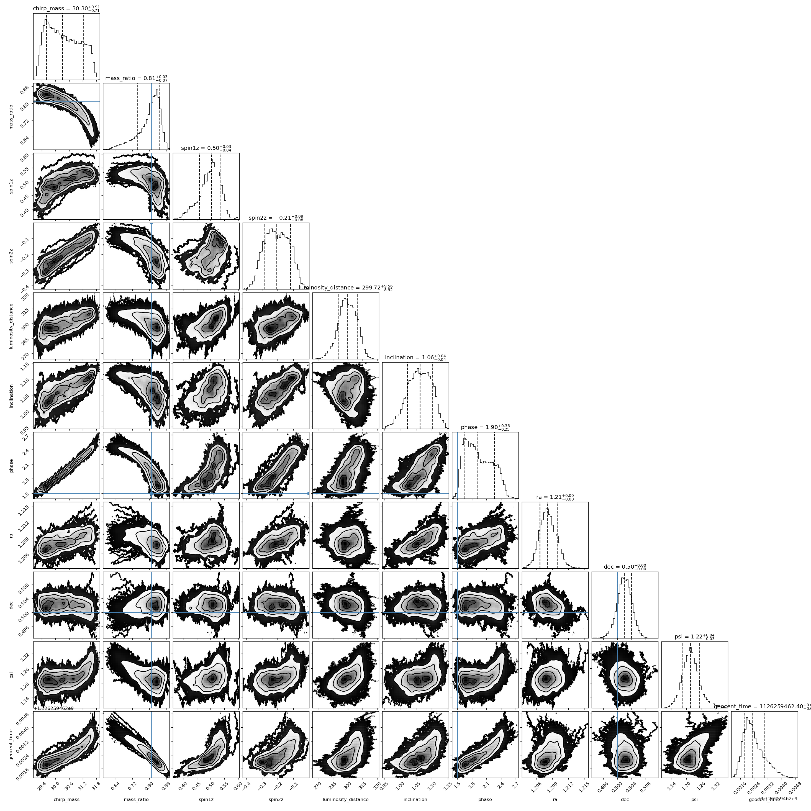
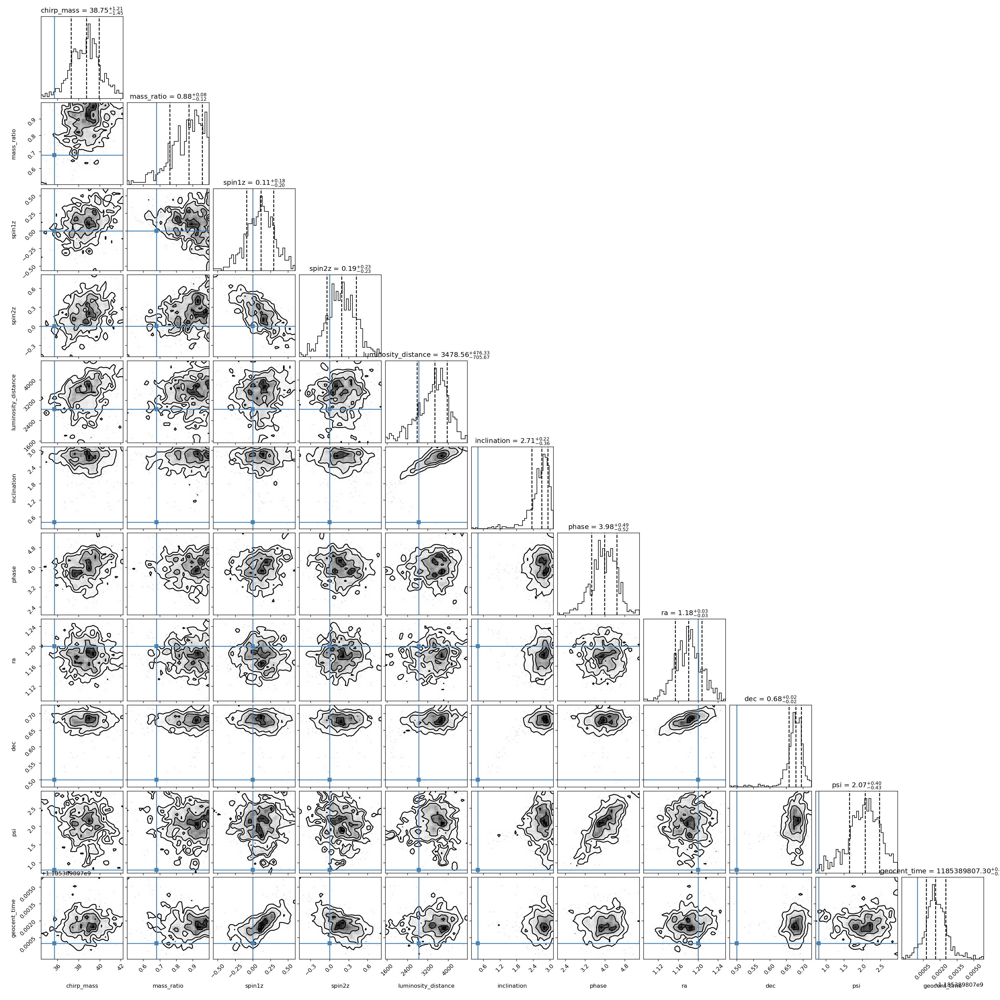
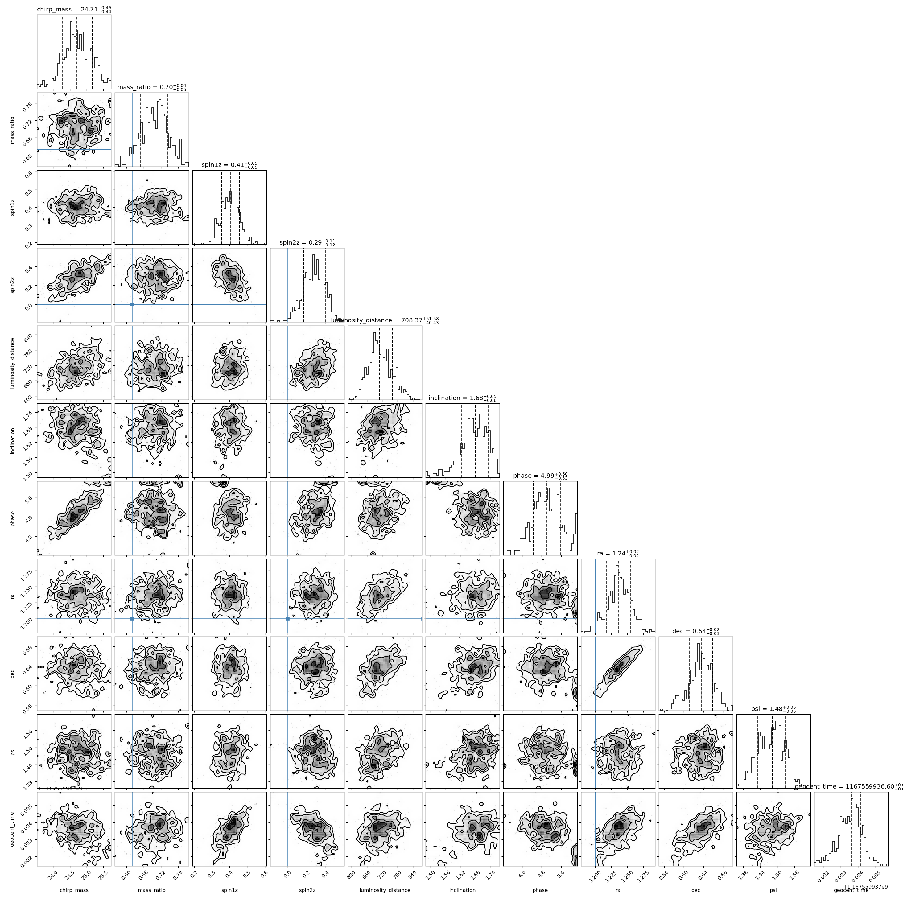
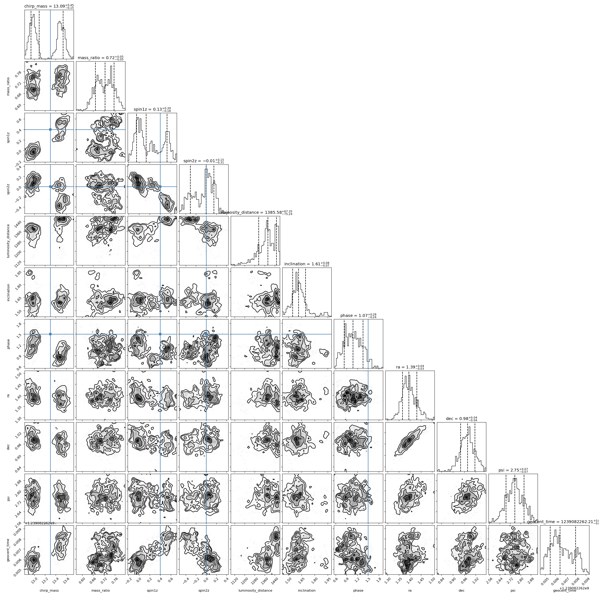
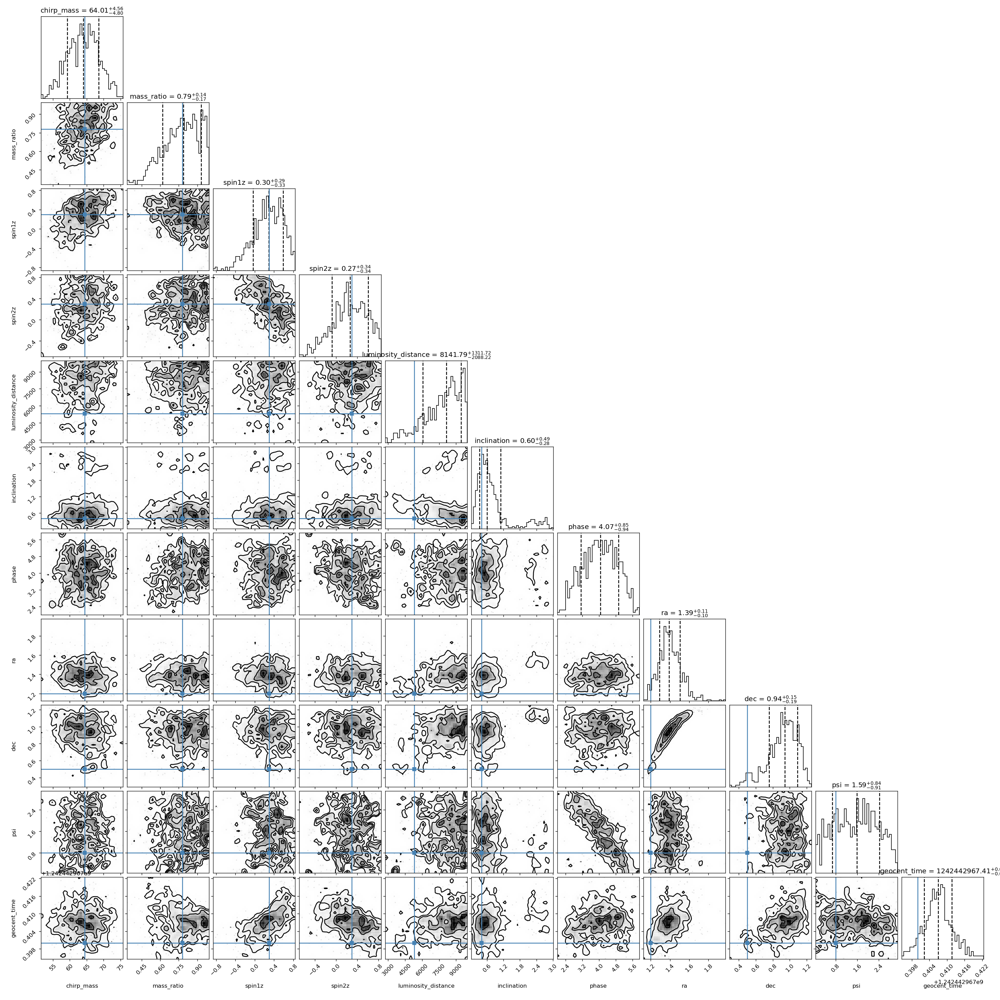

# jaxpe Parameter Estimation Suite
## Frequency-Domain IMRPhenomD Injection Recovery

This document summarizes the results of running the fully autonomous `jaxpe` sampler suite across 5 synthetic gravitational-wave injections based on parameters of prominent GWTC events.

The inference pipeline utilized a zero-noise realization with advanced LIGO Zero-detuning high-power curves, integrated with our global-local normalizing flow Metropolis-Hastings kernel.

### Recovery Summary

| Event | Network SNR | Sampling Time (s) | Samples | Chirp Mass (M⊙) | Mass Ratio (q) | Distance (Mpc) |
|---|---|---|---|---|---|---|
| **GW150914** | 142.0 | 10426.6 | 4,000,000 (raw) | 30.3 (28.1) | 0.81 (0.81) | 300 (410) |
| **GW170729** | 18.1 | 2504.1 | 600 (thinned) | 38.7 (35.7) | 0.88 (0.68) | 3479 (2840) |
| **GW170104** | 29.4 | 2411.0 | 500 (thinned) | 24.7 (21.1) | 0.70 (0.62) | 708 (880) |
| **GW190412** | 18.6 | 2209.7 | 600 (thinned) | 13.1 (13.3) | 0.72 (0.28) | 1386 (740) |
| **GW190521** | 9.4 | 2204.7 | 700 (thinned) | 64.0 (64.4) | 0.79 (0.78) | 8142 (5300) |

*(Values in parentheses denote the true injected values)*

---

### Posterior Corner Plots

#### GW150914 (Raw)

#### GW170729 (Thinned)

#### GW170104 (Thinned)

#### GW190412 (Thinned)

#### GW190521 (Thinned)

